# WallDot Builders - Database Schema Documentation
**Total Tables:** 85
**Database:** PostgreSQL (wdTestDB)

## Table of Contents

1. [activity_feeds](#activity-feeds)
2. [activity_types](#activity-types)
3. [approval_requests](#approval-requests)
4. [boq_items](#boq-items)
5. [boq_work_types](#boq-work-types)
6. [cctv_cameras](#cctv-cameras)
7. [challan_sequences](#challan-sequences)
8. [customer_projects](#customer-projects)
9. [customer_refresh_tokens](#customer-refresh-tokens)
10. [customer_roles](#customer-roles)
11. [customer_users](#customer-users)
12. [delay_logs](#delay-logs)
13. [design_package_payments](#design-package-payments)
14. [design_steps](#design-steps)
15. [document_categories](#document-categories)
16. [feedback_forms](#feedback-forms)
17. [feedback_responses](#feedback-responses)
18. [flyway_schema_history](#flyway-schema-history)
19. [gallery_images](#gallery-images)
20. [goods_received_notes](#goods-received-notes)
21. [inventory_stock](#inventory-stock)
22. [labour](#labour)
23. [labour_advances](#labour-advances)
24. [labour_attendance](#labour-attendance)
25. [labour_payments](#labour-payments)
26. [lead_interactions](#lead-interactions)
27. [lead_quotation_items](#lead-quotation-items)
28. [lead_quotations](#lead-quotations)
29. [lead_score_history](#lead-score-history)
30. [leads](#leads)
31. [material_budgets](#material-budgets)
32. [material_indent_items](#material-indent-items)
33. [material_indents](#material-indents)
34. [materials](#materials)
35. [measurement_book](#measurement-book)
36. [milestone_templates](#milestone-templates)
37. [observations](#observations)
38. [partnership_users](#partnership-users)
39. [payment_challans](#payment-challans)
40. [payment_schedule](#payment-schedule)
41. [payment_transactions](#payment-transactions)
42. [portal_permissions](#portal-permissions)
43. [portal_refresh_tokens](#portal-refresh-tokens)
44. [portal_role_permissions](#portal-role-permissions)
45. [portal_roles](#portal-roles)
46. [portal_users](#portal-users)
47. [project_design_steps](#project-design-steps)
48. [project_documents](#project-documents)
49. [project_invoices](#project-invoices)
50. [project_members](#project-members)
51. [project_milestones](#project-milestones)
52. [project_phases](#project-phases)
53. [project_progress_logs](#project-progress-logs)
54. [project_queries](#project-queries)
55. [project_type_templates](#project-type-templates)
56. [project_variations](#project-variations)
57. [project_warranties](#project-warranties)
58. [purchase_invoices](#purchase-invoices)
59. [purchase_order_items](#purchase-order-items)
60. [purchase_orders](#purchase-orders)
61. [quality_checks](#quality-checks)
62. [receipts](#receipts)
63. [retention_releases](#retention-releases)
64. [site_report_photos](#site-report-photos)
65. [site_reports](#site-reports)
66. [site_visits](#site-visits)
67. [sqft_categories](#sqft-categories)
68. [staff_roles](#staff-roles)
69. [stock_adjustments](#stock-adjustments)
70. [subcontract_measurements](#subcontract-measurements)
71. [subcontract_payments](#subcontract-payments)
72. [subcontract_work_orders](#subcontract-work-orders)
73. [task_alerts](#task-alerts)
74. [task_assignment_history](#task-assignment-history)
75. [tasks](#tasks)
76. [tax_invoices](#tax-invoices)
77. [v_accounts_payable_aging](#v-accounts-payable-aging)
78. [v_pending_vendor_payments](#v-pending-vendor-payments)
79. [v_subcontract_summary](#v-subcontract-summary)
80. [vendor_payments](#vendor-payments)
81. [vendor_quotations](#vendor-quotations)
82. [vendors](#vendors)
83. [view_360](#view-360)
84. [wage_sheet_entries](#wage-sheet-entries)
85. [wage_sheets](#wage-sheets)

---

## Data Type Mappings (PostgreSQL → Java)

| PostgreSQL Type | Java Type | Notes |
|----------------|-----------|-------|
| `bigint` | `Long` | 64-bit integer |
| `boolean` | `Boolean` |  |
| `bytea` | `byte[]` |  |
| `character varying` | `String` |  |
| `date` | `LocalDate` |  |
| `decimal` | `BigDecimal` |  |
| `double precision` | `Double` |  |
| `float4` | `Float` |  |
| `float8` | `Double` |  |
| `int2` | `Short` |  |
| `int4` | `Integer` | 32-bit integer |
| `int8` | `Long` | 64-bit integer |
| `integer` | `Integer` | 32-bit integer |
| `json` | `String` |  |
| `jsonb` | `String` |  |
| `numeric` | `BigDecimal` |  |
| `real` | `Float` |  |
| `smallint` | `Short` |  |
| `text` | `String` |  |
| `time without time zone` | `LocalTime` |  |
| `timestamp with time zone` | `ZonedDateTime` |  |
| `timestamp without time zone` | `LocalDateTime` |  |
| `uuid` | `UUID` |  |
| `varchar` | `String` |  |

---

## activity_feeds

### Columns

| Column Name | Data Type | Nullable | Default | Notes |
|-------------|-----------|----------|---------|-------|
| `id` | `bigint(64)` | ✗ | - | 🔑 PK |
| `created_at` | `timestamp without time zone` | ✗ | - | - |
| `description` | `text` | ✓ | - | - |
| `metadata` | `jsonb` | ✓ | - | - |
| `reference_id` | `bigint(64)` | ✓ | - | - |
| `reference_type` | `character varying(50)` | ✓ | - | - |
| `title` | `character varying(255)` | ✗ | - | - |
| `activity_type_id` | `bigint(64)` | ✗ | - | 🔗 FK → `activity_types.id` |
| `created_by_id` | `bigint(64)` | ✓ | - | 🔗 FK → `customer_users.id` |
| `project_id` | `bigint(64)` | ✓ | - | 🔗 FK → `customer_projects.id` |
| `portal_user_id` | `bigint(64)` | ✓ | - | 🔗 FK → `portal_users.id` |
| `lead_id` | `bigint(64)` | ✓ | - | 🔗 FK → `leads.lead_id` |

### Primary Key

- `id`

### Foreign Keys

- `lead_id` → `leads.lead_id`
- `activity_type_id` → `activity_types.id`
- `portal_user_id` → `portal_users.id`
- `created_by_id` → `customer_users.id`
- `project_id` → `customer_projects.id`

---

## activity_types

### Columns

| Column Name | Data Type | Nullable | Default | Notes |
|-------------|-----------|----------|---------|-------|
| `id` | `bigint(64)` | ✗ | - | 🔑 PK |
| `color` | `character varying(20)` | ✓ | - | - |
| `icon` | `character varying(50)` | ✓ | - | - |
| `name` | `character varying(100)` | ✗ | - | - |
| `description` | `text` | ✓ | - | - |

### Primary Key

- `id`

### Unique Constraints

- `name`

---

## approval_requests

### Columns

| Column Name | Data Type | Nullable | Default | Notes |
|-------------|-----------|----------|---------|-------|
| `id` | `bigint(64)` | ✗ | - | 🔑 PK |
| `comments` | `text` | ✓ | - | - |
| `decided_at` | `timestamp without time zone` | ✓ | - | - |
| `requested_at` | `timestamp without time zone` | ✗ | - | - |
| `status` | `character varying(255)` | ✗ | - | - |
| `target_id` | `bigint(64)` | ✗ | - | - |
| `target_type` | `character varying(255)` | ✗ | - | - |
| `approver_id` | `bigint(64)` | ✓ | - | - |
| `requested_by_id` | `bigint(64)` | ✗ | - | - |

### Primary Key

- `id`

---

## boq_items

### Columns

| Column Name | Data Type | Nullable | Default | Notes |
|-------------|-----------|----------|---------|-------|
| `id` | `bigint(64)` | ✗ | - | 🔑 PK |
| `amount` | `numeric(15,2)` | ✓ | - | - |
| `created_at` | `timestamp without time zone` | ✗ | - | - |
| `description` | `character varying(255)` | ✗ | - | - |
| `is_active` | `boolean` | ✓ | - | - |
| `item_code` | `character varying(50)` | ✓ | - | - |
| `notes` | `text` | ✓ | - | - |
| `quantity` | `numeric(10,2)` | ✗ | - | - |
| `rate` | `numeric(15,2)` | ✗ | - | - |
| `specifications` | `text` | ✓ | - | - |
| `unit` | `character varying(50)` | ✗ | - | - |
| `updated_at` | `timestamp without time zone` | ✗ | - | - |
| `created_by_id` | `bigint(64)` | ✗ | - | 🔗 FK → `customer_users.id` |
| `project_id` | `bigint(64)` | ✗ | - | 🔗 FK → `customer_projects.id` |
| `work_type_id` | `bigint(64)` | ✗ | - | 🔗 FK → `boq_work_types.id` |
| `total_amount` | `numeric(10,2)` | ✓ | - | - |
| `unit_rate` | `numeric(10,2)` | ✓ | - | - |
| `material_id` | `bigint(64)` | ✓ | - | 🔗 FK → `materials.id` |

### Primary Key

- `id`

### Foreign Keys

- `material_id` → `materials.id`
- `created_by_id` → `customer_users.id`
- `project_id` → `customer_projects.id`
- `work_type_id` → `boq_work_types.id`

---

## boq_work_types

### Columns

| Column Name | Data Type | Nullable | Default | Notes |
|-------------|-----------|----------|---------|-------|
| `id` | `bigint(64)` | ✗ | - | 🔑 PK |
| `description` | `character varying(255)` | ✓ | - | - |
| `display_order` | `integer(32)` | ✓ | - | - |
| `name` | `character varying(255)` | ✗ | - | - |

### Primary Key

- `id`

### Unique Constraints

- `name`

---

## cctv_cameras

### Columns

| Column Name | Data Type | Nullable | Default | Notes |
|-------------|-----------|----------|---------|-------|
| `id` | `bigint(64)` | ✗ | - | 🔑 PK |
| `camera_name` | `character varying(100)` | ✗ | - | - |
| `camera_type` | `character varying(50)` | ✓ | - | - |
| `installation_date` | `date` | ✓ | - | - |
| `is_active` | `boolean` | ✓ | - | - |
| `is_installed` | `boolean` | ✓ | - | - |
| `last_active` | `timestamp without time zone` | ✓ | - | - |
| `location` | `character varying(255)` | ✓ | - | - |
| `notes` | `text` | ✓ | - | - |
| `resolution` | `character varying(20)` | ✓ | - | - |
| `snapshot_url` | `character varying(500)` | ✓ | - | - |
| `stream_url` | `character varying(500)` | ✓ | - | - |
| `project_id` | `bigint(64)` | ✗ | - | 🔗 FK → `customer_projects.id` |
| `created_at` | `timestamp without time zone` | ✓ | - | - |
| `description` | `text` | ✓ | - | - |
| `name` | `character varying(255)` | ✗ | - | - |
| `updated_at` | `timestamp without time zone` | ✓ | - | - |

### Primary Key

- `id`

### Foreign Keys

- `project_id` → `customer_projects.id`

---

## challan_sequences

### Columns

| Column Name | Data Type | Nullable | Default | Notes |
|-------------|-----------|----------|---------|-------|
| `id` | `bigint(64)` | ✗ | nextval('challan_sequences_id_seq'::regclass) | 🔑 PK |
| `fy` | `character varying(10)` | ✗ | - | - |
| `last_sequence` | `integer(32)` | ✗ | 0 | - |
| `created_at` | `timestamp without time zone` | ✓ | CURRENT_TIMESTAMP | - |
| `updated_at` | `timestamp without time zone` | ✓ | CURRENT_TIMESTAMP | - |

### Primary Key

- `id`

### Unique Constraints

- `fy`

---

## customer_projects

### Columns

| Column Name | Data Type | Nullable | Default | Notes |
|-------------|-----------|----------|---------|-------|
| `id` | `bigint(64)` | ✗ | nextval('customer_projects_id_seq'::regclass) | 🔑 PK |
| `name` | `character varying(255)` | ✗ | - | - |
| `location` | `character varying(255)` | ✓ | - | - |
| `start_date` | `date` | ✓ | - | - |
| `end_date` | `date` | ✓ | - | - |
| `created_at` | `timestamp without time zone` | ✗ | CURRENT_TIMESTAMP | - |
| `updated_at` | `timestamp without time zone` | ✗ | CURRENT_TIMESTAMP | - |
| `created_by` | `character varying(255)` | ✓ | - | - |
| `project_phase` | `character varying(100)` | ✗ | 'design'::character varying | - |
| `state` | `character varying(50)` | ✗ | - | - |
| `district` | `character varying(50)` | ✗ | - | - |
| `sqfeet` | `numeric(10,2)` | ✓ | - | - |
| `lead_id` | `bigint(64)` | ✓ | - | 🔗 FK → `leads.lead_id` |
| `code` | `character varying(255)` | ✓ | - | - |
| `design_package` | `character varying(255)` | ✓ | - | - |
| `is_design_agreement_signed` | `boolean` | ✗ | false | - |
| `project_uuid` | `uuid` | ✗ | - | - |
| `customer_id` | `bigint(64)` | ✓ | - | 🔗 FK → `customer_users.id` |
| `project_type` | `character varying(255)` | ✓ | - | - |
| `project_manager_id` | `bigint(64)` | ✓ | - | 🔗 FK → `portal_users.id` |
| `contract_type` | `character varying(50)` | ✓ | - | - |
| `converted_by_id` | `bigint(64)` | ✓ | - | 🔗 FK → `portal_users.id` |
| `converted_at` | `timestamp without time zone` | ✓ | - | - |
| `converted_from_lead_id` | `bigint(64)` | ✓ | - | 🔗 FK → `leads.lead_id` |
| `budget` | `numeric(15,2)` | ✓ | - | - |
| `plot_area` | `numeric(10,2)` | ✓ | - | - |
| `floors` | `integer(32)` | ✓ | - | - |
| `facing` | `character varying(20)` | ✓ | - | - |
| `permit_status` | `character varying(50)` | ✓ | - | - |
| `project_description` | `text` | ✓ | - | - |
| `created_by_user_id` | `bigint(64)` | ✓ | - | 🔗 FK → `portal_users.id` |
| `updated_by_user_id` | `bigint(64)` | ✓ | - | 🔗 FK → `portal_users.id` |
| `deleted_at` | `timestamp without time zone` | ✓ | - | - |
| `deleted_by_user_id` | `bigint(64)` | ✓ | - | 🔗 FK → `portal_users.id` |
| `version` | `bigint(64)` | ✗ | 0 | - |
| `project_status` | `character varying(50)` | ✗ | 'ACTIVE'::character varying | - |
| `latitude` | `double precision(53)` | ✓ | - | - |
| `longitude` | `double precision(53)` | ✓ | - | - |
| `overall_progress` | `numeric(5,2)` | ✓ | 0.00 | - |
| `milestone_progress` | `numeric(5,2)` | ✓ | 0.00 | - |
| `task_progress` | `numeric(5,2)` | ✓ | 0.00 | - |
| `budget_progress` | `numeric(5,2)` | ✓ | 0.00 | - |
| `last_progress_update` | `timestamp without time zone` | ✓ | - | - |
| `progress_calculation_method` | `character varying(50)` | ✓ | 'HYBRID'::character varying | - |
| `milestone_weight` | `numeric(3,2)` | ✓ | 0.40 | - |
| `task_weight` | `numeric(3,2)` | ✓ | 0.30 | - |
| `budget_weight` | `numeric(3,2)` | ✓ | 0.30 | - |

### Primary Key

- `id`

### Foreign Keys

- `converted_from_lead_id` → `leads.lead_id`
- `lead_id` → `leads.lead_id`
- `customer_id` → `customer_users.id`
- `project_manager_id` → `portal_users.id`
- `converted_by_id` → `portal_users.id`
- `deleted_by_user_id` → `portal_users.id`
- `updated_by_user_id` → `portal_users.id`
- `created_by_user_id` → `portal_users.id`

### Unique Constraints

- `project_uuid`
- `lead_id`
- `project_uuid`

---

## customer_refresh_tokens

### Columns

| Column Name | Data Type | Nullable | Default | Notes |
|-------------|-----------|----------|---------|-------|
| `id` | `bigint(64)` | ✗ | - | 🔑 PK |
| `expiry_date` | `timestamp without time zone` | ✗ | - | - |
| `revoked` | `boolean` | ✗ | - | - |
| `token` | `character varying(255)` | ✗ | - | - |
| `user_id` | `bigint(64)` | ✗ | - | 🔗 FK → `customer_users.id` |

### Primary Key

- `id`

### Foreign Keys

- `user_id` → `customer_users.id`

### Unique Constraints

- `token`

---

## customer_roles

### Columns

| Column Name | Data Type | Nullable | Default | Notes |
|-------------|-----------|----------|---------|-------|
| `id` | `bigint(64)` | ✗ | - | 🔑 PK |
| `description` | `character varying(255)` | ✓ | - | - |
| `name` | `character varying(255)` | ✗ | - | - |

### Primary Key

- `id`

### Unique Constraints

- `name`

---

## customer_users

### Columns

| Column Name | Data Type | Nullable | Default | Notes |
|-------------|-----------|----------|---------|-------|
| `id` | `bigint(64)` | ✗ | - | 🔑 PK |
| `created_at` | `timestamp without time zone` | ✓ | - | - |
| `email` | `character varying(255)` | ✗ | - | - |
| `enabled` | `boolean` | ✗ | - | - |
| `first_name` | `character varying(255)` | ✓ | - | - |
| `last_name` | `character varying(255)` | ✓ | - | - |
| `password` | `character varying(255)` | ✗ | - | - |
| `updated_at` | `timestamp without time zone` | ✓ | - | - |
| `role_id` | `bigint(64)` | ✓ | - | 🔗 FK → `customer_roles.id` |
| `phone` | `character varying(20)` | ✓ | - | - |
| `whatsapp_number` | `character varying(20)` | ✓ | - | - |
| `address` | `text` | ✓ | - | - |
| `company_name` | `character varying(100)` | ✓ | - | - |
| `gst_number` | `character varying(20)` | ✓ | - | - |
| `lead_source` | `character varying(50)` | ✓ | - | - |
| `notes` | `text` | ✓ | - | - |

### Primary Key

- `id`

### Foreign Keys

- `role_id` → `customer_roles.id`

### Unique Constraints

- `email`

---

## delay_logs

### Columns

| Column Name | Data Type | Nullable | Default | Notes |
|-------------|-----------|----------|---------|-------|
| `id` | `bigint(64)` | ✗ | - | 🔑 PK |
| `created_at` | `timestamp without time zone` | ✗ | - | - |
| `delay_type` | `character varying(50)` | ✗ | - | - |
| `from_date` | `date` | ✗ | - | - |
| `reason_text` | `text` | ✓ | - | - |
| `to_date` | `date` | ✓ | - | - |
| `logged_by_id` | `bigint(64)` | ✓ | - | - |
| `phase_id` | `bigint(64)` | ✓ | - | - |
| `project_id` | `bigint(64)` | ✗ | - | - |

### Primary Key

- `id`

---

## design_package_payments

### Columns

| Column Name | Data Type | Nullable | Default | Notes |
|-------------|-----------|----------|---------|-------|
| `id` | `bigint(64)` | ✗ | nextval('design_package_payments_id_seq'::regclass) | 🔑 PK |
| `project_id` | `bigint(64)` | ✗ | - | 🔗 FK → `customer_projects.id` |
| `package_name` | `character varying(50)` | ✗ | - | - |
| `rate_per_sqft` | `numeric(10,2)` | ✗ | - | - |
| `total_sqft` | `numeric(10,2)` | ✗ | - | - |
| `base_amount` | `numeric(15,2)` | ✗ | - | - |
| `gst_percentage` | `numeric(5,2)` | ✗ | 18.00 | - |
| `gst_amount` | `numeric(15,2)` | ✗ | - | - |
| `discount_percentage` | `numeric(5,2)` | ✓ | 0 | - |
| `discount_amount` | `numeric(15,2)` | ✓ | 0 | - |
| `total_amount` | `numeric(15,2)` | ✗ | - | - |
| `payment_type` | `character varying(20)` | ✗ | - | - |
| `status` | `character varying(20)` | ✗ | 'PENDING'::character varying | - |
| `created_at` | `timestamp without time zone` | ✗ | CURRENT_TIMESTAMP | - |
| `updated_at` | `timestamp without time zone` | ✗ | CURRENT_TIMESTAMP | - |
| `created_by_id` | `bigint(64)` | ✓ | - | 🔗 FK → `portal_users.id` |
| `retention_percentage` | `numeric(5,2)` | ✗ | 10.00 | - |
| `retention_amount` | `numeric(15,2)` | ✗ | 0 | - |
| `retention_released_amount` | `numeric(15,2)` | ✗ | 0 | - |
| `defect_liability_end_date` | `date` | ✓ | - | - |
| `retention_status` | `character varying(20)` | ✗ | 'ACTIVE'::character varying | - |

### Primary Key

- `id`

### Foreign Keys

- `created_by_id` → `portal_users.id`
- `project_id` → `customer_projects.id`

### Unique Constraints

- `project_id`

---

## design_steps

### Columns

| Column Name | Data Type | Nullable | Default | Notes |
|-------------|-----------|----------|---------|-------|
| `id` | `bigint(64)` | ✗ | nextval('design_steps_id_seq'::regclass) | 🔑 PK |
| `step_name` | `character varying(255)` | ✗ | - | - |
| `weight_percentage` | `double precision(53)` | ✗ | - | - |
| `category` | `character varying(50)` | ✓ | - | - |
| `description` | `text` | ✓ | - | - |
| `display_order` | `integer(32)` | ✓ | - | - |

### Primary Key

- `id`

---

## document_categories

### Columns

| Column Name | Data Type | Nullable | Default | Notes |
|-------------|-----------|----------|---------|-------|
| `id` | `bigint(64)` | ✗ | - | 🔑 PK |
| `created_at` | `timestamp without time zone` | ✗ | - | - |
| `description` | `character varying(255)` | ✓ | - | - |
| `display_order` | `integer(32)` | ✓ | - | - |
| `name` | `character varying(100)` | ✗ | - | - |

### Primary Key

- `id`

### Unique Constraints

- `name`

---

## feedback_forms

### Columns

| Column Name | Data Type | Nullable | Default | Notes |
|-------------|-----------|----------|---------|-------|
| `id` | `bigint(64)` | ✗ | - | 🔑 PK |
| `created_at` | `timestamp without time zone` | ✗ | - | - |
| `description` | `text` | ✓ | - | - |
| `form_type` | `character varying(50)` | ✓ | - | - |
| `is_active` | `boolean` | ✓ | - | - |
| `title` | `character varying(255)` | ✗ | - | - |
| `created_by_id` | `bigint(64)` | ✗ | - | 🔗 FK → `portal_users.id` |
| `project_id` | `bigint(64)` | ✗ | - | 🔗 FK → `customer_projects.id` |
| `form_schema` | `jsonb` | ✓ | - | - |
| `updated_at` | `timestamp without time zone` | ✓ | - | - |

### Primary Key

- `id`

### Foreign Keys

- `created_by_id` → `portal_users.id`
- `created_by_id` → `customer_users.id`
- `project_id` → `customer_projects.id`

---

## feedback_responses

### Columns

| Column Name | Data Type | Nullable | Default | Notes |
|-------------|-----------|----------|---------|-------|
| `id` | `bigint(64)` | ✗ | - | 🔑 PK |
| `comments` | `text` | ✓ | - | - |
| `is_completed` | `boolean` | ✓ | - | - |
| `rating` | `integer(32)` | ✓ | - | - |
| `response_data` | `jsonb` | ✓ | - | - |
| `submitted_at` | `timestamp without time zone` | ✗ | - | - |
| `customer_id` | `bigint(64)` | ✗ | - | 🔗 FK → `customer_users.id` |
| `form_id` | `bigint(64)` | ✗ | - | 🔗 FK → `feedback_forms.id` |
| `project_id` | `bigint(64)` | ✗ | - | 🔗 FK → `customer_projects.id` |

### Primary Key

- `id`

### Foreign Keys

- `project_id` → `customer_projects.id`
- `customer_id` → `customer_users.id`
- `form_id` → `feedback_forms.id`

---

## flyway_schema_history

### Columns

| Column Name | Data Type | Nullable | Default | Notes |
|-------------|-----------|----------|---------|-------|
| `installed_rank` | `integer(32)` | ✗ | - | 🔑 PK |
| `version` | `character varying(50)` | ✓ | - | - |
| `description` | `character varying(200)` | ✗ | - | - |
| `type` | `character varying(20)` | ✗ | - | - |
| `script` | `character varying(1000)` | ✗ | - | - |
| `checksum` | `integer(32)` | ✓ | - | - |
| `installed_by` | `character varying(100)` | ✗ | - | - |
| `installed_on` | `timestamp without time zone` | ✗ | now() | - |
| `execution_time` | `integer(32)` | ✗ | - | - |
| `success` | `boolean` | ✗ | - | - |

### Primary Key

- `installed_rank`

---

## gallery_images

### Columns

| Column Name | Data Type | Nullable | Default | Notes |
|-------------|-----------|----------|---------|-------|
| `id` | `bigint(64)` | ✗ | - | 🔑 PK |
| `caption` | `character varying(255)` | ✓ | - | - |
| `image_path` | `character varying(500)` | ✗ | - | - |
| `location_tag` | `character varying(255)` | ✓ | - | - |
| `tags` | `ARRAY` | ✓ | - | - |
| `taken_date` | `date` | ✗ | - | - |
| `thumbnail_path` | `character varying(500)` | ✓ | - | - |
| `uploaded_at` | `timestamp without time zone` | ✗ | - | - |
| `project_id` | `bigint(64)` | ✗ | - | 🔗 FK → `customer_projects.id` |
| `site_report_id` | `bigint(64)` | ✓ | - | 🔗 FK → `site_reports.id` |
| `uploaded_by_id` | `bigint(64)` | ✗ | - | 🔗 FK → `portal_users.id` |
| `created_at` | `timestamp without time zone` | ✓ | - | - |
| `image_url` | `character varying(500)` | ✗ | - | - |

### Primary Key

- `id`

### Foreign Keys

- `site_report_id` → `site_reports.id`
- `project_id` → `customer_projects.id`
- `uploaded_by_id` → `portal_users.id`
- `uploaded_by_id` → `customer_users.id`

---

## goods_received_notes

### Columns

| Column Name | Data Type | Nullable | Default | Notes |
|-------------|-----------|----------|---------|-------|
| `id` | `bigint(64)` | ✗ | nextval('goods_received_notes_id_seq'::regclass) | 🔑 PK |
| `grn_number` | `character varying(50)` | ✗ | - | - |
| `po_id` | `bigint(64)` | ✗ | - | 🔗 FK → `purchase_orders.id` |
| `received_date` | `timestamp without time zone` | ✗ | now() | - |
| `received_by_id` | `bigint(64)` | ✗ | - | - |
| `invoice_number` | `character varying(100)` | ✓ | - | - |
| `invoice_date` | `date` | ✓ | - | - |
| `challan_number` | `character varying(100)` | ✓ | - | - |
| `notes` | `text` | ✓ | - | - |
| `updated_at` | `timestamp without time zone` | ✓ | now() | - |
| `created_at` | `timestamp without time zone` | ✓ | now() | - |
| `created_by_user_id` | `bigint(64)` | ✓ | - | 🔗 FK → `portal_users.id` |
| `updated_by_user_id` | `bigint(64)` | ✓ | - | 🔗 FK → `portal_users.id` |
| `deleted_at` | `timestamp without time zone` | ✓ | - | - |
| `deleted_by_user_id` | `bigint(64)` | ✓ | - | 🔗 FK → `portal_users.id` |
| `version` | `bigint(64)` | ✗ | 0 | - |

### Primary Key

- `id`

### Foreign Keys

- `created_by_user_id` → `portal_users.id`
- `po_id` → `purchase_orders.id`
- `deleted_by_user_id` → `portal_users.id`
- `updated_by_user_id` → `portal_users.id`

### Unique Constraints

- `grn_number`

---

## inventory_stock

### Columns

| Column Name | Data Type | Nullable | Default | Notes |
|-------------|-----------|----------|---------|-------|
| `id` | `bigint(64)` | ✗ | nextval('inventory_stock_id_seq'::regclass) | 🔑 PK |
| `project_id` | `bigint(64)` | ✗ | - | 🔗 FK → `customer_projects.id` |
| `material_id` | `bigint(64)` | ✗ | - | 🔗 FK → `materials.id` |
| `current_quantity` | `numeric(15,2)` | ✗ | 0 | - |
| `created_at` | `timestamp without time zone` | ✓ | now() | - |
| `updated_at` | `timestamp without time zone` | ✓ | now() | - |
| `created_by_user_id` | `bigint(64)` | ✓ | - | 🔗 FK → `portal_users.id` |
| `updated_by_user_id` | `bigint(64)` | ✓ | - | 🔗 FK → `portal_users.id` |
| `deleted_at` | `timestamp without time zone` | ✓ | - | - |
| `deleted_by_user_id` | `bigint(64)` | ✓ | - | 🔗 FK → `portal_users.id` |
| `version` | `bigint(64)` | ✗ | 0 | - |

### Primary Key

- `id`

### Foreign Keys

- `material_id` → `materials.id`
- `deleted_by_user_id` → `portal_users.id`
- `created_by_user_id` → `portal_users.id`
- `project_id` → `customer_projects.id`
- `updated_by_user_id` → `portal_users.id`

### Unique Constraints

- `project_id`
- `material_id`

---

## labour

### Columns

| Column Name | Data Type | Nullable | Default | Notes |
|-------------|-----------|----------|---------|-------|
| `id` | `bigint(64)` | ✗ | - | 🔑 PK |
| `is_active` | `boolean` | ✓ | - | - |
| `created_at` | `timestamp without time zone` | ✗ | - | - |
| `daily_wage` | `numeric(15,2)` | ✗ | - | - |
| `emergency_contact` | `character varying(255)` | ✓ | - | - |
| `id_proof_number` | `character varying(255)` | ✓ | - | - |
| `id_proof_type` | `character varying(255)` | ✓ | - | - |
| `name` | `character varying(255)` | ✗ | - | - |
| `phone` | `character varying(255)` | ✗ | - | - |
| `trade_type` | `character varying(255)` | ✗ | - | - |
| `updated_at` | `timestamp without time zone` | ✓ | CURRENT_TIMESTAMP | - |
| `created_by_user_id` | `bigint(64)` | ✓ | - | - |
| `updated_by_user_id` | `bigint(64)` | ✓ | - | - |
| `deleted_at` | `timestamp without time zone` | ✓ | - | - |
| `deleted_by_user_id` | `bigint(64)` | ✓ | - | - |
| `version` | `bigint(64)` | ✓ | 1 | - |

### Primary Key

- `id`

---

## labour_advances

### Columns

| Column Name | Data Type | Nullable | Default | Notes |
|-------------|-----------|----------|---------|-------|
| `id` | `bigint(64)` | ✗ | - | 🔑 PK |
| `labour_id` | `bigint(64)` | ✗ | - | 🔗 FK → `labour.id` |
| `advance_date` | `date` | ✗ | - | - |
| `amount` | `numeric(15,2)` | ✗ | - | - |
| `recovered_amount` | `numeric(15,2)` | ✗ | 0.00 | - |
| `notes` | `text` | ✓ | - | - |
| `created_at` | `timestamp without time zone` | ✓ | now() | - |
| `updated_at` | `timestamp without time zone` | ✓ | now() | - |
| `created_by_user_id` | `bigint(64)` | ✓ | - | 🔗 FK → `portal_users.id` |
| `updated_by_user_id` | `bigint(64)` | ✓ | - | 🔗 FK → `portal_users.id` |
| `deleted_at` | `timestamp without time zone` | ✓ | - | - |
| `deleted_by_user_id` | `bigint(64)` | ✓ | - | 🔗 FK → `portal_users.id` |
| `version` | `bigint(64)` | ✗ | 1 | - |

### Primary Key

- `id`

### Foreign Keys

- `labour_id` → `labour.id`
- `created_by_user_id` → `portal_users.id`
- `updated_by_user_id` → `portal_users.id`
- `deleted_by_user_id` → `portal_users.id`

---

## labour_attendance

### Columns

| Column Name | Data Type | Nullable | Default | Notes |
|-------------|-----------|----------|---------|-------|
| `id` | `bigint(64)` | ✗ | - | 🔑 PK |
| `attendance_date` | `date` | ✗ | - | - |
| `hours_worked` | `double precision(53)` | ✓ | - | - |
| `recorded_at` | `timestamp without time zone` | ✗ | - | - |
| `status` | `character varying(255)` | ✗ | - | - |
| `labour_id` | `bigint(64)` | ✗ | - | - |
| `project_id` | `bigint(64)` | ✗ | - | - |
| `created_at` | `timestamp without time zone` | ✓ | CURRENT_TIMESTAMP | - |
| `updated_at` | `timestamp without time zone` | ✓ | CURRENT_TIMESTAMP | - |
| `created_by_user_id` | `bigint(64)` | ✓ | - | - |
| `updated_by_user_id` | `bigint(64)` | ✓ | - | - |
| `deleted_at` | `timestamp without time zone` | ✓ | - | - |
| `deleted_by_user_id` | `bigint(64)` | ✓ | - | - |
| `version` | `bigint(64)` | ✓ | 1 | - |

### Primary Key

- `id`

---

## labour_payments

### Columns

| Column Name | Data Type | Nullable | Default | Notes |
|-------------|-----------|----------|---------|-------|
| `id` | `bigint(64)` | ✗ | - | 🔑 PK |
| `amount` | `numeric(15,2)` | ✗ | - | - |
| `created_at` | `timestamp without time zone` | ✗ | - | - |
| `notes` | `text` | ✓ | - | - |
| `payment_date` | `date` | ✗ | - | - |
| `payment_method` | `character varying(255)` | ✓ | - | - |
| `labour_id` | `bigint(64)` | ✗ | - | - |
| `mb_entry_id` | `bigint(64)` | ✓ | - | - |
| `project_id` | `bigint(64)` | ✗ | - | - |
| `updated_at` | `timestamp without time zone` | ✓ | CURRENT_TIMESTAMP | - |
| `created_by_user_id` | `bigint(64)` | ✓ | - | - |
| `updated_by_user_id` | `bigint(64)` | ✓ | - | - |
| `deleted_at` | `timestamp without time zone` | ✓ | - | - |
| `deleted_by_user_id` | `bigint(64)` | ✓ | - | - |
| `version` | `bigint(64)` | ✓ | 1 | - |

### Primary Key

- `id`

---

## lead_interactions

### Columns

| Column Name | Data Type | Nullable | Default | Notes |
|-------------|-----------|----------|---------|-------|
| `id` | `bigint(64)` | ✗ | nextval('lead_interactions_id_seq'::regclass) | 🔑 PK |
| `lead_id` | `bigint(64)` | ✗ | - | 🔗 FK → `leads.lead_id` |
| `interaction_type` | `character varying(50)` | ✗ | - | - |
| `interaction_date` | `timestamp without time zone` | ✗ | CURRENT_TIMESTAMP | - |
| `duration_minutes` | `integer(32)` | ✓ | - | - |
| `subject` | `character varying(255)` | ✓ | - | - |
| `notes` | `text` | ✓ | - | - |
| `outcome` | `character varying(100)` | ✓ | - | - |
| `next_action` | `character varying(255)` | ✓ | - | - |
| `next_action_date` | `timestamp without time zone` | ✓ | - | - |
| `created_by_id` | `bigint(64)` | ✗ | - | 🔗 FK → `portal_users.id` |
| `created_at` | `timestamp without time zone` | ✗ | CURRENT_TIMESTAMP | - |
| `location` | `character varying(255)` | ✓ | - | - |
| `metadata` | `text` | ✓ | - | - |

### Primary Key

- `id`

### Foreign Keys

- `lead_id` → `leads.lead_id`
- `created_by_id` → `portal_users.id`

---

## lead_quotation_items

### Columns

| Column Name | Data Type | Nullable | Default | Notes |
|-------------|-----------|----------|---------|-------|
| `id` | `bigint(64)` | ✗ | nextval('lead_quotation_items_id_seq'::regclass) | 🔑 PK |
| `quotation_id` | `bigint(64)` | ✗ | - | 🔗 FK → `lead_quotations.id` |
| `item_number` | `integer(32)` | ✗ | - | - |
| `description` | `text` | ✗ | - | - |
| `quantity` | `numeric(10,2)` | ✗ | 1 | - |
| `unit_price` | `numeric(12,2)` | ✗ | - | - |
| `total_price` | `numeric(12,2)` | ✗ | - | - |
| `notes` | `text` | ✓ | - | - |

### Primary Key

- `id`

### Foreign Keys

- `quotation_id` → `lead_quotations.id`

### Unique Constraints

- `quotation_id`
- `item_number`

---

## lead_quotations

### Columns

| Column Name | Data Type | Nullable | Default | Notes |
|-------------|-----------|----------|---------|-------|
| `id` | `bigint(64)` | ✗ | nextval('lead_quotations_id_seq'::regclass) | 🔑 PK |
| `lead_id` | `bigint(64)` | ✗ | - | 🔗 FK → `leads.lead_id` |
| `quotation_number` | `character varying(50)` | ✗ | - | - |
| `version` | `integer(32)` | ✗ | 1 | - |
| `title` | `character varying(255)` | ✗ | - | - |
| `description` | `text` | ✓ | - | - |
| `total_amount` | `numeric(12,2)` | ✗ | - | - |
| `tax_amount` | `numeric(12,2)` | ✓ | - | - |
| `discount_amount` | `numeric(12,2)` | ✓ | - | - |
| `final_amount` | `numeric(12,2)` | ✗ | - | - |
| `validity_days` | `integer(32)` | ✓ | 30 | - |
| `status` | `character varying(50)` | ✗ | 'DRAFT'::character varying | - |
| `sent_at` | `timestamp without time zone` | ✓ | - | - |
| `viewed_at` | `timestamp without time zone` | ✓ | - | - |
| `responded_at` | `timestamp without time zone` | ✓ | - | - |
| `created_by_id` | `bigint(64)` | ✓ | - | 🔗 FK → `portal_users.id` |
| `created_at` | `timestamp without time zone` | ✗ | CURRENT_TIMESTAMP | - |
| `updated_at` | `timestamp without time zone` | ✗ | CURRENT_TIMESTAMP | - |
| `notes` | `text` | ✓ | - | - |

### Primary Key

- `id`

### Foreign Keys

- `created_by_id` → `portal_users.id`
- `lead_id` → `leads.lead_id`

### Unique Constraints

- `quotation_number`

---

## lead_score_history

### Columns

| Column Name | Data Type | Nullable | Default | Notes |
|-------------|-----------|----------|---------|-------|
| `id` | `bigint(64)` | ✗ | nextval('lead_score_history_id_seq'::regclass) | 🔑 PK |
| `lead_id` | `bigint(64)` | ✗ | - | 🔗 FK → `leads.lead_id` |
| `previous_score` | `integer(32)` | ✓ | - | - |
| `new_score` | `integer(32)` | ✗ | - | - |
| `previous_category` | `character varying(20)` | ✓ | - | - |
| `new_category` | `character varying(20)` | ✗ | - | - |
| `score_factors` | `jsonb` | ✓ | - | - |
| `reason` | `text` | ✓ | - | - |
| `scored_at` | `timestamp without time zone` | ✗ | CURRENT_TIMESTAMP | - |
| `scored_by_id` | `bigint(64)` | ✓ | - | 🔗 FK → `portal_users.id` |

### Primary Key

- `id`

### Foreign Keys

- `lead_id` → `leads.lead_id`
- `scored_by_id` → `portal_users.id`

---

## leads

### Columns

| Column Name | Data Type | Nullable | Default | Notes |
|-------------|-----------|----------|---------|-------|
| `name` | `character varying(255)` | ✗ | - | - |
| `email` | `character varying(255)` | ✓ | - | - |
| `phone` | `character varying(255)` | ✓ | - | - |
| `whatsapp_number` | `character varying(255)` | ✓ | - | - |
| `lead_source` | `character varying(255)` | ✗ | 'website'::character varying | - |
| `lead_status` | `character varying(255)` | ✗ | 'New Inquiry'::character varying | - |
| `priority` | `character varying(255)` | ✗ | 'low'::character varying | - |
| `customer_type` | `character varying(255)` | ✓ | - | - |
| `address` | `character varying(255)` | ✓ | - | - |
| `project_type` | `character varying(255)` | ✓ | - | - |
| `project_description` | `text` | ✓ | - | - |
| `requirements` | `character varying(255)` | ✓ | - | - |
| `budget` | `numeric(38,2)` | ✓ | - | - |
| `next_follow_up` | `timestamp without time zone` | ✓ | - | - |
| `last_contact_date` | `timestamp without time zone` | ✓ | - | - |
| `assigned_team` | `character varying(255)` | ✓ | - | - |
| `notes` | `text` | ✓ | - | - |
| `client_rating` | `integer(32)` | ✓ | - | - |
| `probability_to_win` | `integer(32)` | ✓ | - | - |
| `lost_reason` | `character varying(255)` | ✓ | - | - |
| `created_at` | `timestamp without time zone` | ✓ | CURRENT_TIMESTAMP | - |
| `updated_at` | `timestamp without time zone` | ✓ | CURRENT_TIMESTAMP | - |
| `lead_id` | `bigint(64)` | ✗ | nextval('leads_lead_id_seq'::regclass) | 🔑 PK |
| `date_of_enquiry` | `date` | ✓ | - | - |
| `state` | `character varying(255)` | ✓ | - | - |
| `district` | `character varying(255)` | ✓ | - | - |
| `location` | `character varying(255)` | ✓ | - | - |
| `project_sqft_area` | `numeric(38,2)` | ✓ | - | - |
| `assigned_to_id` | `bigint(64)` | ✓ | - | 🔗 FK → `portal_users.id` |
| `score` | `integer(32)` | ✓ | 0 | - |
| `score_category` | `character varying(20)` | ✓ | 'COLD'::character varying | - |
| `last_scored_at` | `timestamp without time zone` | ✓ | - | - |
| `score_factors` | `jsonb` | ✓ | - | - |
| `plot_area` | `numeric(10,2)` | ✓ | - | - |
| `floors` | `integer(32)` | ✓ | - | - |
| `created_by_user_id` | `bigint(64)` | ✓ | - | 🔗 FK → `portal_users.id` |
| `updated_by_user_id` | `bigint(64)` | ✓ | - | 🔗 FK → `portal_users.id` |
| `deleted_at` | `timestamp without time zone` | ✓ | - | - |
| `deleted_by_user_id` | `bigint(64)` | ✓ | - | 🔗 FK → `portal_users.id` |
| `version` | `integer(32)` | ✓ | 0 | - |
| `converted_by_id` | `bigint(64)` | ✓ | - | 🔗 FK → `portal_users.id` |
| `converted_at` | `timestamp without time zone` | ✓ | - | - |

### Primary Key

- `lead_id`

### Foreign Keys

- `assigned_to_id` → `portal_users.id`
- `converted_by_id` → `portal_users.id`
- `created_by_user_id` → `portal_users.id`
- `deleted_by_user_id` → `portal_users.id`
- `updated_by_user_id` → `portal_users.id`

---

## material_budgets

### Columns

| Column Name | Data Type | Nullable | Default | Notes |
|-------------|-----------|----------|---------|-------|
| `id` | `bigint(64)` | ✗ | nextval('material_budgets_id_seq'::regclass) | 🔑 PK |
| `project_id` | `bigint(64)` | ✗ | - | 🔗 FK → `customer_projects.id` |
| `material_id` | `bigint(64)` | ✗ | - | 🔗 FK → `materials.id` |
| `budgeted_quantity` | `numeric(15,2)` | ✗ | - | - |
| `estimated_rate` | `numeric(15,2)` | ✓ | - | - |
| `total_budget` | `numeric(15,2)` | ✓ | - | - |
| `created_at` | `timestamp without time zone` | ✗ | now() | - |
| `updated_at` | `timestamp without time zone` | ✗ | now() | - |
| `created_by_user_id` | `bigint(64)` | ✓ | - | 🔗 FK → `portal_users.id` |
| `updated_by_user_id` | `bigint(64)` | ✓ | - | 🔗 FK → `portal_users.id` |
| `deleted_at` | `timestamp without time zone` | ✓ | - | - |
| `deleted_by_user_id` | `bigint(64)` | ✓ | - | 🔗 FK → `portal_users.id` |
| `version` | `bigint(64)` | ✗ | 0 | - |

### Primary Key

- `id`

### Foreign Keys

- `project_id` → `customer_projects.id`
- `deleted_by_user_id` → `portal_users.id`
- `updated_by_user_id` → `portal_users.id`
- `created_by_user_id` → `portal_users.id`
- `material_id` → `materials.id`

---

## material_indent_items

### Columns

| Column Name | Data Type | Nullable | Default | Notes |
|-------------|-----------|----------|---------|-------|
| `id` | `bigint(64)` | ✗ | - | 🔑 PK |
| `indent_id` | `bigint(64)` | ✗ | - | 🔗 FK → `material_indents.id` |
| `material_id` | `bigint(64)` | ✓ | - | 🔗 FK → `materials.id` |
| `item_name` | `character varying(255)` | ✗ | - | - |
| `description` | `text` | ✓ | - | - |
| `unit` | `character varying(255)` | ✗ | - | - |
| `quantity_requested` | `numeric(15,2)` | ✗ | - | - |
| `quantity_approved` | `numeric(15,2)` | ✓ | - | - |
| `po_quantity` | `numeric(15,2)` | ✓ | 0.00 | - |
| `estimated_rate` | `numeric(15,2)` | ✓ | - | - |
| `estimated_amount` | `numeric(15,2)` | ✓ | - | - |
| `created_at` | `timestamp without time zone` | ✓ | now() | - |
| `updated_at` | `timestamp without time zone` | ✓ | now() | - |
| `created_by_user_id` | `bigint(64)` | ✓ | - | 🔗 FK → `portal_users.id` |
| `updated_by_user_id` | `bigint(64)` | ✓ | - | 🔗 FK → `portal_users.id` |
| `deleted_at` | `timestamp without time zone` | ✓ | - | - |
| `deleted_by_user_id` | `bigint(64)` | ✓ | - | 🔗 FK → `portal_users.id` |
| `version` | `bigint(64)` | ✗ | 1 | - |

### Primary Key

- `id`

### Foreign Keys

- `indent_id` → `material_indents.id`
- `material_id` → `materials.id`
- `created_by_user_id` → `portal_users.id`
- `updated_by_user_id` → `portal_users.id`
- `deleted_by_user_id` → `portal_users.id`

---

## material_indents

### Columns

| Column Name | Data Type | Nullable | Default | Notes |
|-------------|-----------|----------|---------|-------|
| `id` | `bigint(64)` | ✗ | - | 🔑 PK |
| `indent_number` | `character varying(255)` | ✗ | - | - |
| `project_id` | `bigint(64)` | ✗ | - | 🔗 FK → `customer_projects.id` |
| `request_date` | `date` | ✗ | - | - |
| `required_date` | `date` | ✗ | - | - |
| `status` | `character varying(255)` | ✗ | 'DRAFT' | - |
| `priority` | `character varying(255)` | ✓ | 'MEDIUM' | - |
| `notes` | `text` | ✓ | - | - |
| `requested_by_id` | `bigint(64)` | ✓ | - | 🔗 FK → `portal_users.id` |
| `approved_by_id` | `bigint(64)` | ✓ | - | 🔗 FK → `portal_users.id` |
| `approved_at` | `timestamp without time zone` | ✓ | - | - |
| `rejection_reason` | `text` | ✓ | - | - |
| `created_at` | `timestamp without time zone` | ✓ | now() | - |
| `updated_at` | `timestamp without time zone` | ✓ | now() | - |
| `created_by_user_id` | `bigint(64)` | ✓ | - | 🔗 FK → `portal_users.id` |
| `updated_by_user_id` | `bigint(64)` | ✓ | - | 🔗 FK → `portal_users.id` |
| `deleted_at` | `timestamp without time zone` | ✓ | - | - |
| `deleted_by_user_id` | `bigint(64)` | ✓ | - | 🔗 FK → `portal_users.id` |
| `version` | `bigint(64)` | ✗ | 1 | - |

### Primary Key

- `id`

### Foreign Keys

- `project_id` → `customer_projects.id`
- `requested_by_id` → `portal_users.id`
- `approved_by_id` → `portal_users.id`
- `created_by_user_id` → `portal_users.id`
- `updated_by_user_id` → `portal_users.id`
- `deleted_by_user_id` → `portal_users.id`

### Unique Constraints

- `indent_number`

---

## materials

### Columns

| Column Name | Data Type | Nullable | Default | Notes |
|-------------|-----------|----------|---------|-------|
| `id` | `bigint(64)` | ✗ | nextval('materials_id_seq'::regclass) | 🔑 PK |
| `name` | `character varying(255)` | ✗ | - | - |
| `unit` | `character varying(255)` | ✗ | - | - |
| `category` | `character varying(255)` | ✗ | - | - |
| `is_active` | `boolean` | ✓ | true | - |
| `created_at` | `timestamp without time zone` | ✗ | now() | - |
| `updated_at` | `timestamp without time zone` | ✓ | now() | - |
| `created_by_user_id` | `bigint(64)` | ✓ | - | 🔗 FK → `portal_users.id` |
| `updated_by_user_id` | `bigint(64)` | ✓ | - | 🔗 FK → `portal_users.id` |
| `deleted_at` | `timestamp without time zone` | ✓ | - | - |
| `deleted_by_user_id` | `bigint(64)` | ✓ | - | 🔗 FK → `portal_users.id` |
| `version` | `bigint(64)` | ✗ | 0 | - |

### Primary Key

- `id`

### Foreign Keys

- `updated_by_user_id` → `portal_users.id`
- `created_by_user_id` → `portal_users.id`
- `deleted_by_user_id` → `portal_users.id`

### Unique Constraints

- `name`

---

## measurement_book

### Columns

| Column Name | Data Type | Nullable | Default | Notes |
|-------------|-----------|----------|---------|-------|
| `id` | `bigint(64)` | ✗ | - | 🔑 PK |
| `breadth` | `numeric(10,2)` | ✓ | - | - |
| `created_at` | `timestamp without time zone` | ✗ | - | - |
| `depth` | `numeric(10,2)` | ✓ | - | - |
| `description` | `character varying(255)` | ✗ | - | - |
| `length` | `numeric(10,2)` | ✓ | - | - |
| `measurement_date` | `date` | ✗ | - | - |
| `quantity` | `numeric(10,2)` | ✗ | - | - |
| `rate` | `numeric(15,2)` | ✓ | - | - |
| `total_amount` | `numeric(15,2)` | ✓ | - | - |
| `unit` | `character varying(255)` | ✗ | - | - |
| `boq_item_id` | `bigint(64)` | ✓ | - | - |
| `labour_id` | `bigint(64)` | ✓ | - | - |
| `project_id` | `bigint(64)` | ✗ | - | - |
| `updated_at` | `timestamp without time zone` | ✓ | CURRENT_TIMESTAMP | - |
| `created_by_user_id` | `bigint(64)` | ✓ | - | - |
| `updated_by_user_id` | `bigint(64)` | ✓ | - | - |
| `deleted_at` | `timestamp without time zone` | ✓ | - | - |
| `deleted_by_user_id` | `bigint(64)` | ✓ | - | - |
| `version` | `bigint(64)` | ✓ | 1 | - |

### Primary Key

- `id`

---

## milestone_templates

### Columns

| Column Name | Data Type | Nullable | Default | Notes |
|-------------|-----------|----------|---------|-------|
| `id` | `bigint(64)` | ✗ | nextval('milestone_templates_id_seq'::regclass) | 🔑 PK |
| `template_id` | `bigint(64)` | ✗ | - | 🔗 FK → `project_type_templates.id` |
| `milestone_name` | `character varying(255)` | ✗ | - | - |
| `milestone_order` | `integer(32)` | ✗ | - | - |
| `default_percentage` | `numeric(5,2)` | ✗ | - | - |
| `description` | `text` | ✓ | - | - |
| `phase` | `character varying(50)` | ✓ | - | - |
| `estimated_duration_days` | `integer(32)` | ✓ | - | - |
| `created_at` | `timestamp without time zone` | ✗ | CURRENT_TIMESTAMP | - |

### Primary Key

- `id`

### Foreign Keys

- `template_id` → `project_type_templates.id`

### Unique Constraints

- `milestone_order`
- `template_id`

---

## observations

### Columns

| Column Name | Data Type | Nullable | Default | Notes |
|-------------|-----------|----------|---------|-------|
| `id` | `bigint(64)` | ✗ | - | 🔑 PK |
| `description` | `text` | ✗ | - | - |
| `image_path` | `character varying(500)` | ✓ | - | - |
| `location` | `character varying(255)` | ✓ | - | - |
| `priority` | `character varying(20)` | ✓ | - | - |
| `reported_date` | `timestamp without time zone` | ✗ | - | - |
| `resolution_notes` | `text` | ✓ | - | - |
| `resolved_date` | `timestamp without time zone` | ✓ | - | - |
| `status` | `character varying(50)` | ✓ | - | - |
| `title` | `character varying(255)` | ✗ | - | - |
| `project_id` | `bigint(64)` | ✗ | - | 🔗 FK → `customer_projects.id` |
| `reported_by_id` | `bigint(64)` | ✗ | - | 🔗 FK → `customer_users.id` |
| `reported_by_role_id` | `bigint(64)` | ✓ | - | 🔗 FK → `staff_roles.id` |
| `resolved_by_id` | `bigint(64)` | ✓ | - | 🔗 FK → `customer_users.id` |
| `created_at` | `timestamp without time zone` | ✓ | - | - |
| `severity` | `character varying(50)` | ✓ | - | - |
| `updated_at` | `timestamp without time zone` | ✓ | - | - |

### Primary Key

- `id`

### Foreign Keys

- `reported_by_id` → `customer_users.id`
- `project_id` → `customer_projects.id`
- `resolved_by_id` → `customer_users.id`
- `reported_by_role_id` → `staff_roles.id`
- `reported_by_id` → `portal_users.id`

---

## partnership_users

### Columns

| Column Name | Data Type | Nullable | Default | Notes |
|-------------|-----------|----------|---------|-------|
| `id` | `bigint(64)` | ✗ | nextval('partnership_users_id_seq'::regclass) | 🔑 PK |
| `phone` | `character varying(15)` | ✗ | - | - |
| `email` | `character varying(255)` | ✗ | - | - |
| `password_hash` | `character varying(255)` | ✗ | - | - |
| `full_name` | `character varying(255)` | ✗ | - | - |
| `designation` | `character varying(255)` | ✓ | - | - |
| `partnership_type` | `character varying(50)` | ✗ | - | - |
| `firm_name` | `character varying(255)` | ✓ | - | - |
| `company_name` | `character varying(255)` | ✓ | - | - |
| `gst_number` | `character varying(20)` | ✓ | - | - |
| `license_number` | `character varying(100)` | ✓ | - | - |
| `rera_number` | `character varying(100)` | ✓ | - | - |
| `cin_number` | `character varying(50)` | ✓ | - | - |
| `ifsc_code` | `character varying(20)` | ✓ | - | - |
| `employee_id` | `character varying(100)` | ✓ | - | - |
| `experience` | `integer(32)` | ✓ | - | - |
| `specialization` | `character varying(255)` | ✓ | - | - |
| `portfolio_link` | `character varying(500)` | ✓ | - | - |
| `certifications` | `text` | ✓ | - | - |
| `area_of_operation` | `character varying(255)` | ✓ | - | - |
| `areas_covered` | `character varying(255)` | ✓ | - | - |
| `land_types` | `character varying(255)` | ✓ | - | - |
| `materials_supplied` | `character varying(500)` | ✓ | - | - |
| `business_size` | `character varying(50)` | ✓ | - | - |
| `location` | `character varying(255)` | ✓ | - | - |
| `industry` | `character varying(255)` | ✓ | - | - |
| `project_type` | `character varying(100)` | ✓ | - | - |
| `project_scale` | `character varying(50)` | ✓ | - | - |
| `timeline` | `character varying(255)` | ✓ | - | - |
| `years_of_practice` | `integer(32)` | ✓ | - | - |
| `area_served` | `character varying(255)` | ✓ | - | - |
| `business_name` | `character varying(255)` | ✓ | - | - |
| `additional_contact` | `character varying(255)` | ✓ | - | - |
| `message` | `text` | ✓ | - | - |
| `status` | `character varying(20)` | ✓ | 'pending'::character varying | - |
| `created_at` | `timestamp without time zone` | ✓ | CURRENT_TIMESTAMP | - |
| `updated_at` | `timestamp without time zone` | ✓ | CURRENT_TIMESTAMP | - |
| `approved_at` | `timestamp without time zone` | ✓ | - | - |
| `last_login` | `timestamp without time zone` | ✓ | - | - |
| `created_by` | `character varying(100)` | ✓ | - | - |
| `updated_by` | `character varying(100)` | ✓ | - | - |

### Primary Key

- `id`

### Unique Constraints

- `email`
- `phone`

---

## payment_challans

### Columns

| Column Name | Data Type | Nullable | Default | Notes |
|-------------|-----------|----------|---------|-------|
| `id` | `bigint(64)` | ✗ | nextval('payment_challans_id_seq'::regclass) | 🔑 PK |
| `transaction_id` | `bigint(64)` | ✗ | - | 🔗 FK → `payment_transactions.id` |
| `challan_number` | `character varying(50)` | ✗ | - | - |
| `fy` | `character varying(10)` | ✗ | - | - |
| `sequence_number` | `integer(32)` | ✗ | - | - |
| `transaction_date` | `timestamp without time zone` | ✗ | - | - |
| `generated_at` | `timestamp without time zone` | ✗ | CURRENT_TIMESTAMP | - |
| `generated_by_id` | `bigint(64)` | ✗ | - | 🔗 FK → `portal_users.id` |
| `status` | `character varying(20)` | ✗ | 'ISSUED'::character varying | - |

### Primary Key

- `id`

### Foreign Keys

- `transaction_id` → `payment_transactions.id`
- `generated_by_id` → `portal_users.id`

### Unique Constraints

- `challan_number`
- `transaction_id`

---

## payment_schedule

### Columns

| Column Name | Data Type | Nullable | Default | Notes |
|-------------|-----------|----------|---------|-------|
| `id` | `bigint(64)` | ✗ | nextval('payment_schedule_id_seq'::regclass) | 🔑 PK |
| `design_payment_id` | `bigint(64)` | ✗ | - | 🔗 FK → `design_package_payments.id` |
| `installment_number` | `integer(32)` | ✗ | - | - |
| `description` | `character varying(100)` | ✗ | - | - |
| `amount` | `numeric(15,2)` | ✗ | - | - |
| `due_date` | `date` | ✓ | - | - |
| `status` | `character varying(20)` | ✗ | 'PENDING'::character varying | - |
| `paid_amount` | `numeric(15,2)` | ✓ | 0 | - |
| `paid_date` | `timestamp without time zone` | ✓ | - | - |
| `created_at` | `timestamp without time zone` | ✗ | CURRENT_TIMESTAMP | - |

### Primary Key

- `id`

### Foreign Keys

- `design_payment_id` → `design_package_payments.id`

---

## payment_transactions

### Columns

| Column Name | Data Type | Nullable | Default | Notes |
|-------------|-----------|----------|---------|-------|
| `id` | `bigint(64)` | ✗ | nextval('payment_transactions_id_seq'::regclass) | 🔑 PK |
| `schedule_id` | `bigint(64)` | ✗ | - | 🔗 FK → `payment_schedule.id` |
| `amount` | `numeric(15,2)` | ✗ | - | - |
| `payment_method` | `character varying(50)` | ✓ | - | - |
| `reference_number` | `character varying(100)` | ✓ | - | - |
| `payment_date` | `timestamp without time zone` | ✗ | - | - |
| `notes` | `text` | ✓ | - | - |
| `recorded_by_id` | `bigint(64)` | ✗ | - | 🔗 FK → `portal_users.id` |
| `created_at` | `timestamp without time zone` | ✗ | CURRENT_TIMESTAMP | - |
| `receipt_number` | `character varying(50)` | ✓ | - | - |
| `status` | `character varying(20)` | ✓ | 'COMPLETED'::character varying | - |
| `tds_percentage` | `numeric(5,2)` | ✗ | 0 | - |
| `tds_amount` | `numeric(15,2)` | ✗ | 0 | - |
| `net_amount` | `numeric(15,2)` | ✗ | - | - |
| `tds_deducted_by` | `character varying(50)` | ✗ | 'CUSTOMER'::character varying | - |
| `payment_category` | `character varying(50)` | ✗ | 'PROGRESS'::character varying | - |

### Primary Key

- `id`

### Foreign Keys

- `recorded_by_id` → `portal_users.id`
- `schedule_id` → `payment_schedule.id`

### Unique Constraints

- `receipt_number`

---

## portal_permissions

### Columns

| Column Name | Data Type | Nullable | Default | Notes |
|-------------|-----------|----------|---------|-------|
| `id` | `bigint(64)` | ✗ | nextval('portal_permissions_id_seq'::regclass) | 🔑 PK |
| `name` | `character varying(255)` | ✗ | - | - |
| `description` | `character varying(255)` | ✓ | - | - |

### Primary Key

- `id`

### Unique Constraints

- `name`

---

## portal_refresh_tokens

### Columns

| Column Name | Data Type | Nullable | Default | Notes |
|-------------|-----------|----------|---------|-------|
| `id` | `bigint(64)` | ✗ | nextval('portal_refresh_tokens_id_seq'::regclass) | 🔑 PK |
| `token` | `character varying(4096)` | ✗ | - | - |
| `user_id` | `bigint(64)` | ✗ | - | 🔗 FK → `portal_users.id` |
| `expiry_date` | `timestamp without time zone` | ✗ | - | - |
| `revoked` | `boolean` | ✗ | false | - |

### Primary Key

- `id`

### Foreign Keys

- `user_id` → `portal_users.id`

### Unique Constraints

- `token`

---

## portal_role_permissions

### Columns

| Column Name | Data Type | Nullable | Default | Notes |
|-------------|-----------|----------|---------|-------|
| `role_id` | `bigint(64)` | ✗ | - | 🔑 PK, 🔗 FK → `portal_roles.id` |
| `permission_id` | `bigint(64)` | ✗ | - | 🔑 PK, 🔗 FK → `portal_permissions.id` |

### Primary Key

- `role_id`
- `permission_id`

### Foreign Keys

- `role_id` → `portal_roles.id`
- `permission_id` → `portal_permissions.id`

---

## portal_roles

### Columns

| Column Name | Data Type | Nullable | Default | Notes |
|-------------|-----------|----------|---------|-------|
| `id` | `bigint(64)` | ✗ | nextval('portal_roles_id_seq'::regclass) | 🔑 PK |
| `name` | `character varying(255)` | ✗ | - | - |
| `description` | `character varying(255)` | ✓ | - | - |
| `code` | `text` | ✓ | - | - |

### Primary Key

- `id`

### Unique Constraints

- `name`

---

## portal_users

### Columns

| Column Name | Data Type | Nullable | Default | Notes |
|-------------|-----------|----------|---------|-------|
| `id` | `bigint(64)` | ✗ | nextval('portal_users_id_seq'::regclass) | 🔑 PK |
| `email` | `character varying(255)` | ✗ | - | - |
| `password` | `character varying(255)` | ✗ | - | - |
| `first_name` | `character varying(255)` | ✓ | - | - |
| `last_name` | `character varying(255)` | ✓ | - | - |
| `role_id` | `bigint(64)` | ✓ | - | 🔗 FK → `portal_roles.id` |
| `enabled` | `boolean` | ✗ | true | - |
| `created_at` | `timestamp without time zone` | ✓ | now() | - |
| `updated_at` | `timestamp without time zone` | ✓ | now() | - |
| `created_by_user_id` | `bigint(64)` | ✓ | - | 🔗 FK → `portal_users.id` |
| `updated_by_user_id` | `bigint(64)` | ✓ | - | 🔗 FK → `portal_users.id` |
| `deleted_at` | `timestamp without time zone` | ✓ | - | - |
| `deleted_by_user_id` | `bigint(64)` | ✓ | - | 🔗 FK → `portal_users.id` |
| `version` | `integer(32)` | ✓ | 0 | - |

### Primary Key

- `id`

### Foreign Keys

- `created_by_user_id` → `portal_users.id`
- `role_id` → `portal_roles.id`
- `deleted_by_user_id` → `portal_users.id`
- `updated_by_user_id` → `portal_users.id`

### Unique Constraints

- `email`

---

## project_design_steps

### Columns

| Column Name | Data Type | Nullable | Default | Notes |
|-------------|-----------|----------|---------|-------|
| `id` | `bigint(64)` | ✗ | nextval('project_design_steps_id_seq'::regclass) | 🔑 PK |
| `project_uuid` | `uuid` | ✓ | - | 🔗 FK → `customer_projects.project_uuid` |
| `step_id` | `bigint(64)` | ✓ | - | 🔗 FK → `design_steps.id` |
| `status` | `character varying(50)` | ✓ | 'not_started'::design_step_status | - |
| `progress_percentage` | `double precision(53)` | ✓ | 0 | - |
| `project_id` | `bigint(64)` | ✗ | - | 🔗 FK → `customer_projects.id` |
| `completed_at` | `timestamp without time zone` | ✓ | - | - |
| `completion_percentage` | `integer(32)` | ✓ | - | - |
| `created_at` | `timestamp without time zone` | ✓ | - | - |
| `notes` | `text` | ✓ | - | - |
| `started_at` | `timestamp without time zone` | ✓ | - | - |
| `updated_at` | `timestamp without time zone` | ✓ | - | - |
| `design_step_id` | `bigint(64)` | ✗ | - | 🔗 FK → `design_steps.id` |

### Primary Key

- `id`

### Foreign Keys

- `design_step_id` → `design_steps.id`
- `project_uuid` → `customer_projects.project_uuid`
- `project_id` → `customer_projects.id`
- `step_id` → `design_steps.id`

### Unique Constraints

- `step_id`
- `project_uuid`
- `step_id`
- `project_id`

---

## project_documents

### Columns

| Column Name | Data Type | Nullable | Default | Notes |
|-------------|-----------|----------|---------|-------|
| `id` | `bigint(64)` | ✗ | - | 🔑 PK |
| `description` | `text` | ✓ | - | - |
| `file_path` | `character varying(500)` | ✗ | - | - |
| `file_size` | `bigint(64)` | ✓ | - | - |
| `file_type` | `character varying(50)` | ✓ | - | - |
| `filename` | `character varying(255)` | ✗ | - | - |
| `is_active` | `boolean` | ✓ | - | - |
| `created_at` | `timestamp without time zone` | ✗ | - | - |
| `version` | `integer(32)` | ✓ | - | - |
| `category_id` | `bigint(64)` | ✗ | - | 🔗 FK → `document_categories.id` |
| `created_by_user_id` | `bigint(64)` | ✗ | - | 🔗 FK → `customer_users.id` |
| `reference_id` | `bigint(64)` | ✓ | - | - |
| `reference_type` | `character varying(50)` | ✓ | - | - |
| `updated_at` | `timestamp without time zone` | ✓ | - | - |
| `updated_by_user_id` | `bigint(64)` | ✓ | - | - |
| `deleted_at` | `timestamp without time zone` | ✓ | - | - |
| `deleted_by_user_id` | `bigint(64)` | ✓ | - | - |

### Primary Key

- `id`

### Foreign Keys

- `created_by_user_id` → `customer_users.id`
- `category_id` → `document_categories.id`

---

## project_invoices

### Columns

| Column Name | Data Type | Nullable | Default | Notes |
|-------------|-----------|----------|---------|-------|
| `id` | `bigint(64)` | ✗ | - | 🔑 PK |
| `created_at` | `timestamp without time zone` | ✗ | - | - |
| `due_date` | `date` | ✓ | - | - |
| `gst_amount` | `numeric(15,2)` | ✗ | - | - |
| `gst_percentage` | `numeric(5,2)` | ✗ | - | - |
| `invoice_date` | `date` | ✗ | - | - |
| `invoice_number` | `character varying(255)` | ✗ | - | - |
| `notes` | `text` | ✓ | - | - |
| `status` | `character varying(255)` | ✗ | - | - |
| `sub_total` | `numeric(15,2)` | ✗ | - | - |
| `total_amount` | `numeric(15,2)` | ✗ | - | - |
| `project_id` | `bigint(64)` | ✗ | - | - |

### Primary Key

- `id`

---

## project_members

### Columns

| Column Name | Data Type | Nullable | Default | Notes |
|-------------|-----------|----------|---------|-------|
| `project_id` | `bigint(64)` | ✗ | - | 🔗 FK → `customer_projects.id` |
| `role_in_project` | `character varying(50)` | ✓ | - | - |
| `portal_user_id` | `bigint(64)` | ✓ | - | 🔗 FK → `portal_users.id` |
| `id` | `bigint(64)` | ✗ | - | - |
| `created_at` | `timestamp without time zone` | ✓ | - | - |
| `customer_user_id` | `bigint(64)` | ✓ | - | 🔗 FK → `customer_users.id` |

### Foreign Keys

- `customer_user_id` → `customer_users.id`
- `project_id` → `customer_projects.id`
- `project_id` → `customer_projects.id`
- `portal_user_id` → `portal_users.id`

---

## project_milestones

### Columns

| Column Name | Data Type | Nullable | Default | Notes |
|-------------|-----------|----------|---------|-------|
| `id` | `bigint(64)` | ✗ | - | 🔑 PK |
| `project_id` | `bigint(64)` | ✗ | - | 🔗 FK → `customer_projects.id` |
| `name` | `character varying(100)` | ✗ | - | - |
| `description` | `character varying(500)` | ✓ | - | - |
| `milestone_percentage` | `numeric(5,2)` | ✓ | - | - |
| `amount` | `numeric(15,2)` | ✗ | - | - |
| `status` | `character varying(20)` | ✗ | 'PENDING' | - |
| `due_date` | `date` | ✓ | - | - |
| `completed_date` | `date` | ✓ | - | - |
| `invoice_id` | `bigint(64)` | ✓ | - | 🔗 FK → `project_invoices.id` |
| `template_id` | `bigint(64)` | ✓ | - | 🔗 FK → `milestone_templates.id` |
| `completion_percentage` | `numeric(5,2)` | ✓ | 0.00 | - |
| `weight_percentage` | `numeric(5,2)` | ✓ | - | - |
| `actual_start_date` | `date` | ✓ | - | - |
| `actual_end_date` | `date` | ✓ | - | - |
| `created_at` | `timestamp without time zone` | ✗ | now() | - |
| `updated_at` | `timestamp without time zone` | ✓ | now() | - |

### Primary Key

- `id`

### Foreign Keys

- `project_id` → `customer_projects.id`
- `invoice_id` → `project_invoices.id`
- `template_id` → `milestone_templates.id`

---

## project_phases

### Columns

| Column Name | Data Type | Nullable | Default | Notes |
|-------------|-----------|----------|---------|-------|
| `id` | `bigint(64)` | ✗ | - | 🔑 PK |
| `actual_end` | `date` | ✓ | - | - |
| `actual_start` | `date` | ✓ | - | - |
| `created_at` | `timestamp without time zone` | ✗ | - | - |
| `display_order` | `integer(32)` | ✓ | - | - |
| `phase_name` | `character varying(100)` | ✗ | - | - |
| `planned_end` | `date` | ✓ | - | - |
| `planned_start` | `date` | ✓ | - | - |
| `status` | `character varying(20)` | ✓ | - | - |
| `updated_at` | `timestamp without time zone` | ✓ | - | - |
| `project_id` | `bigint(64)` | ✗ | - | - |

### Primary Key

- `id`

---

## project_progress_logs

### Columns

| Column Name | Data Type | Nullable | Default | Notes |
|-------------|-----------|----------|---------|-------|
| `id` | `bigint(64)` | ✗ | nextval('project_progress_logs_id_seq'::regclass) | 🔑 PK |
| `project_id` | `bigint(64)` | ✗ | - | 🔗 FK → `customer_projects.id` |
| `previous_progress` | `numeric(5,2)` | ✓ | - | - |
| `new_progress` | `numeric(5,2)` | ✓ | - | - |
| `previous_milestone_progress` | `numeric(5,2)` | ✓ | - | - |
| `new_milestone_progress` | `numeric(5,2)` | ✓ | - | - |
| `previous_task_progress` | `numeric(5,2)` | ✓ | - | - |
| `new_task_progress` | `numeric(5,2)` | ✓ | - | - |
| `previous_budget_progress` | `numeric(5,2)` | ✓ | - | - |
| `new_budget_progress` | `numeric(5,2)` | ✓ | - | - |
| `change_reason` | `text` | ✓ | - | - |
| `change_type` | `character varying(50)` | ✓ | - | - |
| `changed_by` | `bigint(64)` | ✓ | - | 🔗 FK → `portal_users.id` |
| `changed_at` | `timestamp without time zone` | ✗ | CURRENT_TIMESTAMP | - |

### Primary Key

- `id`

### Foreign Keys

- `changed_by` → `portal_users.id`
- `project_id` → `customer_projects.id`

---

## project_queries

### Columns

| Column Name | Data Type | Nullable | Default | Notes |
|-------------|-----------|----------|---------|-------|
| `id` | `bigint(64)` | ✗ | - | 🔑 PK |
| `category` | `character varying(50)` | ✓ | - | - |
| `description` | `text` | ✗ | - | - |
| `priority` | `character varying(20)` | ✓ | - | - |
| `raised_date` | `timestamp without time zone` | ✗ | - | - |
| `resolution` | `text` | ✓ | - | - |
| `resolved_date` | `timestamp without time zone` | ✓ | - | - |
| `status` | `character varying(50)` | ✓ | - | - |
| `title` | `character varying(255)` | ✗ | - | - |
| `assigned_to_id` | `bigint(64)` | ✓ | - | 🔗 FK → `customer_users.id` |
| `project_id` | `bigint(64)` | ✗ | - | 🔗 FK → `customer_projects.id` |
| `raised_by_id` | `bigint(64)` | ✗ | - | 🔗 FK → `customer_users.id` |
| `raised_by_role_id` | `bigint(64)` | ✓ | - | 🔗 FK → `staff_roles.id` |
| `resolved_by_id` | `bigint(64)` | ✓ | - | 🔗 FK → `customer_users.id` |
| `answer` | `text` | ✓ | - | - |
| `created_at` | `timestamp without time zone` | ✓ | - | - |
| `question` | `text` | ✓ | - | - |
| `responded_at` | `timestamp without time zone` | ✓ | - | - |
| `subject` | `character varying(255)` | ✗ | - | - |
| `asked_by` | `bigint(64)` | ✓ | - | 🔗 FK → `customer_users.id` |
| `responded_by_id` | `bigint(64)` | ✓ | - | 🔗 FK → `portal_users.id` |

### Primary Key

- `id`

### Foreign Keys

- `assigned_to_id` → `customer_users.id`
- `responded_by_id` → `portal_users.id`
- `raised_by_role_id` → `staff_roles.id`
- `raised_by_id` → `customer_users.id`
- `project_id` → `customer_projects.id`
- `resolved_by_id` → `customer_users.id`
- `asked_by` → `customer_users.id`

---

## project_type_templates

### Columns

| Column Name | Data Type | Nullable | Default | Notes |
|-------------|-----------|----------|---------|-------|
| `id` | `bigint(64)` | ✗ | nextval('project_type_templates_id_seq'::regclass) | 🔑 PK |
| `project_type` | `character varying(100)` | ✗ | - | - |
| `description` | `text` | ✓ | - | - |
| `category` | `character varying(50)` | ✓ | - | - |
| `created_at` | `timestamp without time zone` | ✗ | CURRENT_TIMESTAMP | - |
| `updated_at` | `timestamp without time zone` | ✓ | CURRENT_TIMESTAMP | - |

### Primary Key

- `id`

### Unique Constraints

- `project_type`

---

## project_variations

### Columns

| Column Name | Data Type | Nullable | Default | Notes |
|-------------|-----------|----------|---------|-------|
| `id` | `bigint(64)` | ✗ | - | 🔑 PK |
| `approved_at` | `timestamp without time zone` | ✓ | - | - |
| `client_approved` | `boolean` | ✓ | - | - |
| `created_at` | `timestamp without time zone` | ✗ | - | - |
| `description` | `text` | ✗ | - | - |
| `estimated_amount` | `numeric(15,2)` | ✗ | - | - |
| `notes` | `text` | ✓ | - | - |
| `status` | `character varying(20)` | ✓ | - | - |
| `updated_at` | `timestamp without time zone` | ✓ | - | - |
| `approved_by_id` | `bigint(64)` | ✓ | - | - |
| `created_by_user_id` | `bigint(64)` | ✓ | - | - |
| `project_id` | `bigint(64)` | ✗ | - | - |
| `updated_by_user_id` | `bigint(64)` | ✓ | - | - |
| `deleted_at` | `timestamp without time zone` | ✓ | - | - |
| `deleted_by_user_id` | `bigint(64)` | ✓ | - | - |
| `version` | `bigint(64)` | ✓ | 1 | - |

### Primary Key

- `id`

---

## project_warranties

### Columns

| Column Name | Data Type | Nullable | Default | Notes |
|-------------|-----------|----------|---------|-------|
| `id` | `bigint(64)` | ✗ | nextval('project_warranties_id_seq'::regclass) | 🔑 PK |
| `project_id` | `bigint(64)` | ✗ | - | 🔗 FK → `customer_projects.id` |
| `component_name` | `character varying(255)` | ✗ | - | - |
| `description` | `text` | ✓ | - | - |
| `provider_name` | `character varying(255)` | ✓ | - | - |
| `start_date` | `date` | ✓ | - | - |
| `end_date` | `date` | ✓ | - | - |
| `status` | `character varying(20)` | ✗ | 'ACTIVE'::character varying | - |
| `coverage_details` | `text` | ✓ | - | - |
| `created_at` | `timestamp without time zone` | ✓ | now() | - |
| `updated_at` | `timestamp without time zone` | ✓ | now() | - |
| `created_by_user_id` | `bigint(64)` | ✓ | - | 🔗 FK → `portal_users.id` |
| `updated_by_user_id` | `bigint(64)` | ✓ | - | 🔗 FK → `portal_users.id` |
| `deleted_at` | `timestamp without time zone` | ✓ | - | - |
| `deleted_by_user_id` | `bigint(64)` | ✓ | - | 🔗 FK → `portal_users.id` |
| `version` | `bigint(64)` | ✓ | 1 | - |

### Primary Key

- `id`

### Foreign Keys

- `deleted_by_user_id` → `portal_users.id`
- `updated_by_user_id` → `portal_users.id`
- `created_by_user_id` → `portal_users.id`
- `project_id` → `customer_projects.id`

---

## purchase_invoices

### Columns

| Column Name | Data Type | Nullable | Default | Notes |
|-------------|-----------|----------|---------|-------|
| `id` | `bigint(64)` | ✗ | nextval('purchase_invoices_id_seq'::regclass) | 🔑 PK |
| `vendor_id` | `bigint(64)` | ✗ | - | 🔗 FK → `vendors.id` |
| `project_id` | `bigint(64)` | ✗ | - | 🔗 FK → `customer_projects.id` |
| `po_id` | `bigint(64)` | ✓ | - | 🔗 FK → `purchase_orders.id` |
| `grn_id` | `bigint(64)` | ✓ | - | 🔗 FK → `goods_received_notes.id` |
| `vendor_invoice_number` | `character varying(100)` | ✗ | - | - |
| `invoice_number` | `character varying(100)` | ✓ | - | - |
| `invoice_date` | `date` | ✗ | - | - |
| `amount` | `numeric(15,2)` | ✗ | - | - |
| `status` | `character varying(20)` | ✗ | 'PENDING'::character varying | - |
| `created_at` | `timestamp without time zone` | ✗ | now() | - |
| `invoice_amount` | `numeric(15,2)` | ✓ | - | - |
| `gst_amount` | `numeric(15,2)` | ✓ | 0 | - |
| `paid_amount` | `numeric(15,2)` | ✓ | 0 | - |
| `balance_due` | `numeric(15,2)` | ✓ | - | - |
| `due_date` | `date` | ✓ | - | - |
| `payment_status` | `character varying(20)` | ✓ | 'UNPAID'::character varying | - |
| `payment_terms` | `character varying(100)` | ✓ | - | - |

### Primary Key

- `id`

### Foreign Keys

- `vendor_id` → `vendors.id`
- `grn_id` → `goods_received_notes.id`
- `po_id` → `purchase_orders.id`
- `project_id` → `customer_projects.id`

---

## purchase_order_items

### Columns

| Column Name | Data Type | Nullable | Default | Notes |
|-------------|-----------|----------|---------|-------|
| `id` | `bigint(64)` | ✗ | nextval('purchase_order_items_id_seq'::regclass) | 🔑 PK |
| `po_id` | `bigint(64)` | ✗ | - | 🔗 FK → `purchase_orders.id` |
| `material_id` | `bigint(64)` | ✓ | - | 🔗 FK → `materials.id` |
| `description` | `character varying(255)` | ✗ | - | - |
| `quantity` | `numeric(15,2)` | ✗ | - | - |
| `unit` | `character varying(50)` | ✗ | - | - |
| `rate` | `numeric(15,2)` | ✗ | - | - |
| `gst_percentage` | `numeric(5,2)` | ✗ | 18.00 | - |
| `amount` | `numeric(15,2)` | ✗ | - | - |
| `created_at` | `timestamp without time zone` | ✓ | now() | - |
| `updated_at` | `timestamp without time zone` | ✓ | now() | - |
| `created_by_user_id` | `bigint(64)` | ✓ | - | 🔗 FK → `portal_users.id` |
| `updated_by_user_id` | `bigint(64)` | ✓ | - | 🔗 FK → `portal_users.id` |
| `version` | `bigint(64)` | ✗ | 0 | - |

### Primary Key

- `id`

### Foreign Keys

- `updated_by_user_id` → `portal_users.id`
- `po_id` → `purchase_orders.id`
- `created_by_user_id` → `portal_users.id`
- `material_id` → `materials.id`

---

## purchase_orders

### Columns

| Column Name | Data Type | Nullable | Default | Notes |
|-------------|-----------|----------|---------|-------|
| `id` | `bigint(64)` | ✗ | nextval('purchase_orders_id_seq'::regclass) | 🔑 PK |
| `po_number` | `character varying(50)` | ✗ | - | - |
| `vendor_id` | `bigint(64)` | ✗ | - | 🔗 FK → `vendors.id` |
| `project_id` | `bigint(64)` | ✗ | - | 🔗 FK → `customer_projects.id` |
| `po_date` | `date` | ✗ | - | - |
| `expected_delivery_date` | `date` | ✓ | - | - |
| `total_amount` | `numeric(15,2)` | ✗ | 0 | - |
| `gst_amount` | `numeric(15,2)` | ✗ | 0 | - |
| `net_amount` | `numeric(15,2)` | ✗ | 0 | - |
| `status` | `character varying(20)` | ✗ | 'DRAFT'::character varying | - |
| `notes` | `text` | ✓ | - | - |
| `created_by_user_id` | `bigint(64)` | ✓ | - | 🔗 FK → `portal_users.id` |
| `created_at` | `timestamp without time zone` | ✗ | now() | - |
| `updated_at` | `timestamp without time zone` | ✗ | now() | - |
| `updated_by_user_id` | `bigint(64)` | ✓ | - | 🔗 FK → `portal_users.id` |
| `deleted_at` | `timestamp without time zone` | ✓ | - | - |
| `deleted_by_user_id` | `bigint(64)` | ✓ | - | 🔗 FK → `portal_users.id` |
| `version` | `bigint(64)` | ✗ | 0 | - |

### Primary Key

- `id`

### Foreign Keys

- `vendor_id` → `vendors.id`
- `created_by_user_id` → `portal_users.id`
- `project_id` → `customer_projects.id`
- `updated_by_user_id` → `portal_users.id`
- `deleted_by_user_id` → `portal_users.id`

### Unique Constraints

- `po_number`

---

## quality_checks

### Columns

| Column Name | Data Type | Nullable | Default | Notes |
|-------------|-----------|----------|---------|-------|
| `id` | `bigint(64)` | ✗ | - | 🔑 PK |
| `created_at` | `timestamp without time zone` | ✗ | - | - |
| `description` | `text` | ✓ | - | - |
| `priority` | `character varying(20)` | ✓ | - | - |
| `resolution_notes` | `text` | ✓ | - | - |
| `resolved_at` | `timestamp without time zone` | ✓ | - | - |
| `sop_reference` | `character varying(100)` | ✓ | - | - |
| `status` | `character varying(50)` | ✓ | - | - |
| `title` | `character varying(255)` | ✗ | - | - |
| `assigned_to_id` | `bigint(64)` | ✓ | - | 🔗 FK → `customer_users.id` |
| `created_by_id` | `bigint(64)` | ✗ | - | 🔗 FK → `customer_users.id` |
| `project_id` | `bigint(64)` | ✗ | - | 🔗 FK → `customer_projects.id` |
| `resolved_by_id` | `bigint(64)` | ✓ | - | 🔗 FK → `customer_users.id` |
| `check_date` | `timestamp without time zone` | ✓ | - | - |
| `remarks` | `text` | ✓ | - | - |
| `result` | `character varying(50)` | ✓ | - | - |
| `updated_at` | `timestamp without time zone` | ✓ | - | - |
| `conducted_by` | `bigint(64)` | ✓ | - | 🔗 FK → `portal_users.id` |

### Primary Key

- `id`

### Foreign Keys

- `conducted_by` → `portal_users.id`
- `created_by_id` → `customer_users.id`
- `resolved_by_id` → `customer_users.id`
- `assigned_to_id` → `customer_users.id`
- `project_id` → `customer_projects.id`

---

## receipts

### Columns

| Column Name | Data Type | Nullable | Default | Notes |
|-------------|-----------|----------|---------|-------|
| `id` | `bigint(64)` | ✗ | - | 🔑 PK |
| `project_id` | `bigint(64)` | ✗ | - | 🔗 FK → `customer_projects.id` |
| `invoice_id` | `bigint(64)` | ✓ | - | 🔗 FK → `project_invoices.id` |
| `receipt_number` | `character varying(255)` | ✗ | - | - |
| `amount` | `numeric(15,2)` | ✗ | - | - |
| `payment_date` | `date` | ✗ | - | - |
| `payment_method` | `character varying(50)` | ✓ | - | - |
| `transaction_reference` | `character varying(100)` | ✓ | - | - |
| `notes` | `character varying(500)` | ✓ | - | - |
| `created_at` | `timestamp without time zone` | ✗ | now() | - |

### Primary Key

- `id`

### Foreign Keys

- `project_id` → `customer_projects.id`
- `invoice_id` → `project_invoices.id`

### Unique Constraints

- `receipt_number`

---

## retention_releases

### Columns

| Column Name | Data Type | Nullable | Default | Notes |
|-------------|-----------|----------|---------|-------|
| `id` | `bigint(64)` | ✗ | nextval('retention_releases_id_seq'::regclass) | 🔑 PK |
| `payment_id` | `bigint(64)` | ✗ | - | 🔗 FK → `design_package_payments.id` |
| `release_amount` | `numeric(15,2)` | ✗ | - | - |
| `release_date` | `timestamp without time zone` | ✗ | CURRENT_TIMESTAMP | - |
| `release_reason` | `character varying(255)` | ✓ | - | - |
| `approved_by_id` | `bigint(64)` | ✓ | - | 🔗 FK → `portal_users.id` |
| `notes` | `text` | ✓ | - | - |
| `created_at` | `timestamp without time zone` | ✓ | CURRENT_TIMESTAMP | - |

### Primary Key

- `id`

### Foreign Keys

- `approved_by_id` → `portal_users.id`
- `payment_id` → `design_package_payments.id`

---

## site_report_photos

### Columns

| Column Name | Data Type | Nullable | Default | Notes |
|-------------|-----------|----------|---------|-------|
| `id` | `bigint(64)` | ✗ | nextval('site_report_photos_id_seq'::regclass) | 🔑 PK |
| `site_report_id` | `bigint(64)` | ✗ | - | 🔗 FK → `site_reports.id` |
| `photo_url` | `text` | ✗ | - | - |
| `storage_path` | `text` | ✗ | - | - |
| `created_at` | `timestamp without time zone` | ✗ | CURRENT_TIMESTAMP | - |

### Primary Key

- `id`

### Foreign Keys

- `site_report_id` → `site_reports.id`

### Indexes

- `idx_site_report_photos_report` → `site_report_id`

---

## site_reports

### Columns

| Column Name | Data Type | Nullable | Default | Notes |
|-------------|-----------|----------|---------|-------|
| `id` | `bigint(64)` | ✗ | nextval('site_reports_id_seq'::regclass) | 🔑 PK |
| `project_id` | `bigint(64)` | ✗ | - | 🔗 FK → `customer_projects.id` |
| `title` | `character varying(255)` | ✗ | - | - |
| `description` | `text` | ✓ | - | - |
| `report_date` | `timestamp without time zone` | ✗ | CURRENT_TIMESTAMP | - |
| `status` | `character varying(50)` | ✗ | 'SUBMITTED' | - |
| `submitted_by` | `bigint(64)` | ✓ | - | 🔗 FK → `portal_users.id` |
| `created_at` | `timestamp without time zone` | ✗ | CURRENT_TIMESTAMP | - |
| `updated_at` | `timestamp without time zone` | ✗ | CURRENT_TIMESTAMP | - |
| `report_type` | `character varying(50)` | ✗ | 'DAILY_PROGRESS' | - |
| `site_visit_id` | `bigint(64)` | ✓ | - | 🔗 FK → `site_visits.id` |

### Primary Key

- `id`

### Foreign Keys

- `project_id` → `customer_projects.id`
- `submitted_by` → `portal_users.id`
- `site_visit_id` → `site_visits.id`

### Indexes

- `idx_site_reports_project` → `project_id`
- `idx_site_reports_visit` → `site_visit_id`

---

## site_visits

### Columns

| Column Name | Data Type | Nullable | Default | Notes |
|-------------|-----------|----------|---------|-------|
| `id` | `bigint(64)` | ✗ | - | 🔑 PK |
| `attendees` | `ARRAY` | ✓ | - | - |
| `check_in_time` | `timestamp without time zone` | ✗ | - | - |
| `check_out_time` | `timestamp without time zone` | ✓ | - | - |
| `findings` | `text` | ✓ | - | - |
| `location` | `character varying(255)` | ✓ | - | - |
| `notes` | `text` | ✓ | - | - |
| `purpose` | `character varying(255)` | ✓ | - | - |
| `weather_conditions` | `character varying(100)` | ✓ | - | - |
| `project_id` | `bigint(64)` | ✗ | - | 🔗 FK → `customer_projects.id` |
| `visitor_id` | `bigint(64)` | ✗ | - | 🔗 FK → `customer_users.id` |
| `visitor_role_id` | `bigint(64)` | ✓ | - | 🔗 FK → `staff_roles.id` |
| `created_at` | `timestamp without time zone` | ✓ | - | - |
| `visit_date` | `timestamp without time zone` | ✓ | - | - |
| `visited_by` | `bigint(64)` | ✓ | - | 🔗 FK → `portal_users.id` |
| `check_in_latitude` | `double precision(53)` | ✓ | - | - |
| `check_in_longitude` | `double precision(53)` | ✓ | - | - |
| `check_out_latitude` | `double precision(53)` | ✓ | - | - |
| `check_out_longitude` | `double precision(53)` | ✓ | - | - |
| `visit_type` | `character varying(50)` | ✓ | 'GENERAL'::character varying | - |
| `visit_status` | `character varying(50)` | ✓ | 'PENDING'::character varying | - |
| `duration_minutes` | `integer(32)` | ✓ | - | - |
| `check_out_notes` | `text` | ✓ | - | - |

### Primary Key

- `id`

### Foreign Keys

- `visitor_role_id` → `staff_roles.id`
- `project_id` → `customer_projects.id`
- `visited_by` → `portal_users.id`
- `visitor_id` → `customer_users.id`

---

## sqft_categories

### Columns

| Column Name | Data Type | Nullable | Default | Notes |
|-------------|-----------|----------|---------|-------|
| `id` | `uuid` | ✗ | gen_random_uuid() | 🔑 PK |
| `category` | `character varying(50)` | ✗ | - | - |
| `lowest_sqft` | `integer(32)` | ✗ | - | - |
| `highest_sqft` | `integer(32)` | ✗ | - | - |
| `modified_by` | `character varying(100)` | ✓ | - | - |
| `update_date` | `timestamp without time zone` | ✓ | CURRENT_TIMESTAMP | - |
| `description` | `text` | ✓ | - | - |
| `max_sqft` | `integer(32)` | ✓ | - | - |
| `min_sqft` | `integer(32)` | ✓ | - | - |
| `name` | `character varying(100)` | ✓ | - | - |

### Primary Key

- `id`

---

## staff_roles

### Columns

| Column Name | Data Type | Nullable | Default | Notes |
|-------------|-----------|----------|---------|-------|
| `id` | `bigint(64)` | ✗ | - | 🔑 PK |
| `name` | `character varying(100)` | ✗ | - | - |
| `description` | `text` | ✓ | - | - |
| `display_order` | `integer(32)` | ✓ | - | - |

### Primary Key

- `id`

### Unique Constraints

- `name`

---

## stock_adjustments

### Columns

| Column Name | Data Type | Nullable | Default | Notes |
|-------------|-----------|----------|---------|-------|
| `id` | `bigint(64)` | ✗ | nextval('stock_adjustments_id_seq'::regclass) | 🔑 PK |
| `project_id` | `bigint(64)` | ✗ | - | 🔗 FK → `customer_projects.id` |
| `material_id` | `bigint(64)` | ✗ | - | 🔗 FK → `materials.id` |
| `adjustment_type` | `character varying(30)` | ✗ | - | - |
| `quantity` | `numeric(15,2)` | ✗ | - | - |
| `reason` | `text` | ✓ | - | - |
| `created_by_user_id` | `bigint(64)` | ✓ | - | 🔗 FK → `portal_users.id` |
| `created_at` | `timestamp without time zone` | ✓ | now() | - |
| `updated_at` | `timestamp without time zone` | ✓ | now() | - |
| `updated_by_user_id` | `bigint(64)` | ✓ | - | 🔗 FK → `portal_users.id` |
| `deleted_at` | `timestamp without time zone` | ✓ | - | - |
| `deleted_by_user_id` | `bigint(64)` | ✓ | - | 🔗 FK → `portal_users.id` |
| `version` | `bigint(64)` | ✗ | 0 | - |

### Primary Key

- `id`

### Foreign Keys

- `material_id` → `materials.id`
- `updated_by_user_id` → `portal_users.id`
- `project_id` → `customer_projects.id`
- `deleted_by_user_id` → `portal_users.id`
- `created_by_user_id` → `portal_users.id`

---

## subcontract_measurements

### Columns

| Column Name | Data Type | Nullable | Default | Notes |
|-------------|-----------|----------|---------|-------|
| `id` | `bigint(64)` | ✗ | nextval('subcontract_measurements_id_seq'::regclass) | 🔑 PK |
| `work_order_id` | `bigint(64)` | ✗ | - | 🔗 FK → `subcontract_work_orders.id` |
| `measurement_date` | `date` | ✗ | - | - |
| `description` | `character varying(255)` | ✗ | - | - |
| `quantity` | `numeric(15,2)` | ✗ | - | - |
| `unit` | `character varying(50)` | ✗ | - | - |
| `rate` | `numeric(15,2)` | ✗ | - | - |
| `amount` | `numeric(15,2)` | ✗ | - | - |
| `bill_number` | `character varying(50)` | ✓ | - | - |
| `status` | `character varying(20)` | ✗ | 'PENDING'::character varying | - |
| `approved_by_id` | `bigint(64)` | ✓ | - | 🔗 FK → `portal_users.id` |
| `approved_at` | `timestamp without time zone` | ✓ | - | - |
| `rejection_reason` | `text` | ✓ | - | - |
| `measured_by_id` | `bigint(64)` | ✓ | - | 🔗 FK → `portal_users.id` |
| `created_at` | `timestamp without time zone` | ✗ | now() | - |

### Primary Key

- `id`

### Foreign Keys

- `approved_by_id` → `portal_users.id`
- `measured_by_id` → `portal_users.id`
- `work_order_id` → `subcontract_work_orders.id`

---

## subcontract_payments

### Columns

| Column Name | Data Type | Nullable | Default | Notes |
|-------------|-----------|----------|---------|-------|
| `id` | `bigint(64)` | ✗ | nextval('subcontract_payments_id_seq'::regclass) | 🔑 PK |
| `work_order_id` | `bigint(64)` | ✗ | - | 🔗 FK → `subcontract_work_orders.id` |
| `payment_date` | `date` | ✗ | - | - |
| `gross_amount` | `numeric(15,2)` | ✗ | - | - |
| `tds_percentage` | `numeric(5,2)` | ✗ | 1.00 | - |
| `tds_amount` | `numeric(15,2)` | ✗ | - | - |
| `other_deductions` | `numeric(15,2)` | ✓ | 0 | - |
| `net_amount` | `numeric(15,2)` | ✗ | - | - |
| `payment_mode` | `character varying(20)` | ✗ | - | - |
| `transaction_reference` | `character varying(100)` | ✓ | - | - |
| `cheque_number` | `character varying(50)` | ✓ | - | - |
| `bank_name` | `character varying(255)` | ✓ | - | - |
| `milestone_description` | `character varying(255)` | ✓ | - | - |
| `milestone_percentage` | `numeric(5,2)` | ✓ | - | - |
| `is_advance_payment` | `boolean` | ✓ | false | - |
| `measurement_ids` | `ARRAY` | ✓ | - | - |
| `paid_by_id` | `bigint(64)` | ✓ | - | 🔗 FK → `portal_users.id` |
| `approved_by_id` | `bigint(64)` | ✓ | - | 🔗 FK → `portal_users.id` |
| `notes` | `text` | ✓ | - | - |
| `created_at` | `timestamp without time zone` | ✗ | now() | - |

### Primary Key

- `id`

### Foreign Keys

- `work_order_id` → `subcontract_work_orders.id`
- `approved_by_id` → `portal_users.id`
- `paid_by_id` → `portal_users.id`

---

## subcontract_work_orders

### Columns

| Column Name | Data Type | Nullable | Default | Notes |
|-------------|-----------|----------|---------|-------|
| `id` | `bigint(64)` | ✗ | nextval('subcontract_work_orders_id_seq'::regclass) | 🔑 PK |
| `work_order_number` | `character varying(50)` | ✗ | - | - |
| `project_id` | `bigint(64)` | ✗ | - | 🔗 FK → `customer_projects.id` |
| `vendor_id` | `bigint(64)` | ✗ | - | 🔗 FK → `vendors.id` |
| `boq_item_id` | `bigint(64)` | ✓ | - | 🔗 FK → `boq_items.id` |
| `scope_description` | `text` | ✗ | - | - |
| `measurement_basis` | `character varying(20)` | ✗ | 'UNIT_RATE'::character varying | - |
| `negotiated_amount` | `numeric(15,2)` | ✗ | - | - |
| `unit` | `character varying(50)` | ✓ | - | - |
| `rate` | `numeric(15,2)` | ✓ | - | - |
| `start_date` | `date` | ✓ | - | - |
| `target_completion_date` | `date` | ✓ | - | - |
| `actual_completion_date` | `date` | ✓ | - | - |
| `payment_terms` | `text` | ✓ | - | - |
| `advance_percentage` | `numeric(5,2)` | ✓ | 0 | - |
| `advance_paid` | `numeric(15,2)` | ✓ | 0 | - |
| `status` | `character varying(20)` | ✗ | 'DRAFT'::character varying | - |
| `created_by_user_id` | `bigint(64)` | ✓ | - | 🔗 FK → `portal_users.id` |
| `created_at` | `timestamp without time zone` | ✗ | now() | - |
| `updated_at` | `timestamp without time zone` | ✗ | now() | - |
| `notes` | `text` | ✓ | - | - |
| `termination_reason` | `text` | ✓ | - | - |
| `updated_by_user_id` | `bigint(64)` | ✓ | - | 🔗 FK → `portal_users.id` |
| `deleted_at` | `timestamp without time zone` | ✓ | - | - |
| `deleted_by_user_id` | `bigint(64)` | ✓ | - | 🔗 FK → `portal_users.id` |
| `version` | `bigint(64)` | ✗ | 0 | - |

### Primary Key

- `id`

### Foreign Keys

- `vendor_id` → `vendors.id`
- `created_by_user_id` → `portal_users.id`
- `project_id` → `customer_projects.id`
- `deleted_by_user_id` → `portal_users.id`
- `updated_by_user_id` → `portal_users.id`
- `boq_item_id` → `boq_items.id`

### Unique Constraints

- `work_order_number`

---

## task_alerts

### Columns

| Column Name | Data Type | Nullable | Default | Notes |
|-------------|-----------|----------|---------|-------|
| `id` | `bigint(64)` | ✗ | nextval('task_alerts_id_seq'::regclass) | 🔑 PK |
| `task_id` | `bigint(64)` | ✗ | - | 🔗 FK → `tasks.id` |
| `alert_type` | `character varying(20)` | ✗ | - | - |
| `severity` | `character varying(20)` | ✗ | - | - |
| `alert_message` | `text` | ✗ | - | - |
| `sent_at` | `timestamp without time zone` | ✗ | CURRENT_TIMESTAMP | - |
| `sent_to_user_id` | `bigint(64)` | ✓ | - | 🔗 FK → `portal_users.id` |
| `sent_to_email` | `character varying(255)` | ✓ | - | - |
| `delivery_status` | `character varying(20)` | ✓ | 'SENT'::character varying | - |
| `created_at` | `timestamp without time zone` | ✗ | CURRENT_TIMESTAMP | - |

### Primary Key

- `id`

### Foreign Keys

- `sent_to_user_id` → `portal_users.id`
- `task_id` → `tasks.id`

---

## task_assignment_history

### Columns

| Column Name | Data Type | Nullable | Default | Notes |
|-------------|-----------|----------|---------|-------|
| `id` | `bigint(64)` | ✗ | nextval('task_assignment_history_id_seq'::regclass) | 🔑 PK |
| `task_id` | `bigint(64)` | ✗ | - | 🔗 FK → `tasks.id` |
| `assigned_from_id` | `bigint(64)` | ✓ | - | 🔗 FK → `portal_users.id` |
| `assigned_to_id` | `bigint(64)` | ✓ | - | 🔗 FK → `portal_users.id` |
| `assigned_by_id` | `bigint(64)` | ✗ | - | 🔗 FK → `portal_users.id` |
| `assigned_at` | `timestamp without time zone` | ✗ | CURRENT_TIMESTAMP | - |
| `notes` | `text` | ✓ | - | - |

### Primary Key

- `id`

### Foreign Keys

- `assigned_by_id` → `portal_users.id`
- `assigned_from_id` → `portal_users.id`
- `task_id` → `tasks.id`
- `assigned_by_id` → `portal_users.id`
- `assigned_to_id` → `portal_users.id`
- `assigned_from_id` → `portal_users.id`
- `task_id` → `tasks.id`
- `assigned_to_id` → `portal_users.id`

---

## tasks

### Columns

| Column Name | Data Type | Nullable | Default | Notes |
|-------------|-----------|----------|---------|-------|
| `id` | `bigint(64)` | ✗ | nextval('tasks_id_seq'::regclass) | 🔑 PK |
| `title` | `character varying(255)` | ✗ | - | - |
| `description` | `text` | ✓ | - | - |
| `status` | `character varying(255)` | ✗ | 'PENDING'::character varying | - |
| `priority` | `character varying(255)` | ✗ | 'MEDIUM'::character varying | - |
| `assigned_to` | `bigint(64)` | ✓ | - | 🔗 FK → `portal_users.id` |
| `created_by` | `bigint(64)` | ✓ | - | 🔗 FK → `portal_users.id` |
| `project_id` | `bigint(64)` | ✓ | - | 🔗 FK → `customer_projects.id` |
| `due_date` | `date` | ✗ | - | - |
| `created_at` | `timestamp without time zone` | ✗ | CURRENT_TIMESTAMP | - |
| `updated_at` | `timestamp without time zone` | ✓ | CURRENT_TIMESTAMP | - |
| `lead_id` | `bigint(64)` | ✓ | - | 🔗 FK → `leads.lead_id` |
| `created_by_user_id` | `bigint(64)` | ✓ | - | 🔗 FK → `portal_users.id` |
| `updated_by_user_id` | `bigint(64)` | ✓ | - | 🔗 FK → `portal_users.id` |
| `deleted_at` | `timestamp without time zone` | ✓ | - | - |
| `deleted_by_user_id` | `bigint(64)` | ✓ | - | 🔗 FK → `portal_users.id` |
| `version` | `integer(32)` | ✓ | 0 | - |

### Primary Key

- `id`

### Foreign Keys

- `lead_id` → `leads.lead_id`
- `assigned_to` → `portal_users.id`
- `updated_by_user_id` → `portal_users.id`
- `created_by` → `portal_users.id`
- `project_id` → `customer_projects.id`
- `created_by_user_id` → `portal_users.id`
- `deleted_by_user_id` → `portal_users.id`
- `project_id` → `customer_projects.id`

---

## tax_invoices

### Columns

| Column Name | Data Type | Nullable | Default | Notes |
|-------------|-----------|----------|---------|-------|
| `id` | `bigint(64)` | ✗ | nextval('tax_invoices_id_seq'::regclass) | 🔑 PK |
| `invoice_number` | `character varying(50)` | ✗ | - | - |
| `payment_id` | `bigint(64)` | ✗ | - | 🔗 FK → `design_package_payments.id` |
| `company_gstin` | `character varying(15)` | ✗ | '29AABCU9603R1ZX'::character varying | - |
| `customer_gstin` | `character varying(15)` | ✓ | - | - |
| `place_of_supply` | `character varying(100)` | ✗ | - | - |
| `is_interstate` | `boolean` | ✗ | false | - |
| `taxable_value` | `numeric(15,2)` | ✗ | - | - |
| `cgst_rate` | `numeric(5,2)` | ✓ | - | - |
| `cgst_amount` | `numeric(15,2)` | ✓ | - | - |
| `sgst_rate` | `numeric(5,2)` | ✓ | - | - |
| `sgst_amount` | `numeric(15,2)` | ✓ | - | - |
| `igst_rate` | `numeric(5,2)` | ✓ | - | - |
| `igst_amount` | `numeric(15,2)` | ✓ | - | - |
| `total_tax_amount` | `numeric(15,2)` | ✗ | - | - |
| `invoice_total` | `numeric(15,2)` | ✗ | - | - |
| `invoice_date` | `date` | ✗ | CURRENT_DATE | - |
| `financial_year` | `character varying(10)` | ✗ | - | - |
| `created_at` | `timestamp without time zone` | ✓ | CURRENT_TIMESTAMP | - |
| `created_by_id` | `bigint(64)` | ✓ | - | 🔗 FK → `portal_users.id` |

### Primary Key

- `id`

### Foreign Keys

- `payment_id` → `design_package_payments.id`
- `created_by_id` → `portal_users.id`

### Unique Constraints

- `invoice_number`

---

## v_accounts_payable_aging

### Columns

| Column Name | Data Type | Nullable | Default | Notes |
|-------------|-----------|----------|---------|-------|
| `vendor_id` | `bigint(64)` | ✓ | - | - |
| `vendor_name` | `character varying(255)` | ✓ | - | - |
| `total_invoices` | `bigint(64)` | ✓ | - | - |
| `total_outstanding` | `numeric` | ✓ | - | - |
| `due_0_30_days` | `numeric` | ✓ | - | - |
| `due_31_60_days` | `numeric` | ✓ | - | - |
| `overdue` | `numeric` | ✓ | - | - |
| `overdue_invoice_count` | `bigint(64)` | ✓ | - | - |

---

## v_pending_vendor_payments

### Columns

| Column Name | Data Type | Nullable | Default | Notes |
|-------------|-----------|----------|---------|-------|
| `invoice_id` | `bigint(64)` | ✓ | - | - |
| `invoice_number` | `character varying(100)` | ✓ | - | - |
| `invoice_date` | `date` | ✓ | - | - |
| `due_date` | `date` | ✓ | - | - |
| `vendor_id` | `bigint(64)` | ✓ | - | - |
| `vendor_name` | `character varying(255)` | ✓ | - | - |
| `project_id` | `bigint(64)` | ✓ | - | - |
| `project_name` | `character varying(255)` | ✓ | - | - |
| `invoice_amount` | `numeric(15,2)` | ✓ | - | - |
| `paid_amount` | `numeric(15,2)` | ✓ | - | - |
| `balance_due` | `numeric(15,2)` | ✓ | - | - |
| `payment_status` | `character varying(20)` | ✓ | - | - |
| `days_overdue` | `integer(32)` | ✓ | - | - |
| `urgency` | `text` | ✓ | - | - |

---

## v_subcontract_summary

### Columns

| Column Name | Data Type | Nullable | Default | Notes |
|-------------|-----------|----------|---------|-------|
| `work_order_id` | `bigint(64)` | ✓ | - | - |
| `work_order_number` | `character varying(50)` | ✓ | - | - |
| `project_id` | `bigint(64)` | ✓ | - | - |
| `project_name` | `character varying(255)` | ✓ | - | - |
| `vendor_id` | `bigint(64)` | ✓ | - | - |
| `vendor_name` | `character varying(255)` | ✓ | - | - |
| `scope_description` | `text` | ✓ | - | - |
| `total_contract_amount` | `numeric(15,2)` | ✓ | - | - |
| `measurement_basis` | `character varying(20)` | ✓ | - | - |
| `status` | `character varying(20)` | ✓ | - | - |
| `total_measured_amount` | `numeric` | ✓ | - | - |
| `pending_measurements` | `bigint(64)` | ✓ | - | - |
| `total_paid` | `numeric` | ✓ | - | - |
| `total_tds` | `numeric` | ✓ | - | - |
| `balance_due` | `numeric` | ✓ | - | - |
| `start_date` | `date` | ✓ | - | - |
| `target_completion_date` | `date` | ✓ | - | - |
| `actual_completion_date` | `date` | ✓ | - | - |

---

## vendor_payments

### Columns

| Column Name | Data Type | Nullable | Default | Notes |
|-------------|-----------|----------|---------|-------|
| `id` | `bigint(64)` | ✗ | nextval('vendor_payments_id_seq'::regclass) | 🔑 PK |
| `invoice_id` | `bigint(64)` | ✗ | - | 🔗 FK → `purchase_invoices.id` |
| `payment_date` | `date` | ✗ | - | - |
| `amount_paid` | `numeric(15,2)` | ✗ | - | - |
| `tds_deducted` | `numeric(15,2)` | ✓ | 0 | - |
| `other_deductions` | `numeric(15,2)` | ✓ | 0 | - |
| `net_paid` | `numeric(15,2)` | ✗ | - | - |
| `payment_mode` | `character varying(20)` | ✗ | - | - |
| `transaction_reference` | `character varying(100)` | ✓ | - | - |
| `cheque_number` | `character varying(50)` | ✓ | - | - |
| `bank_name` | `character varying(255)` | ✓ | - | - |
| `created_by_user_id` | `bigint(64)` | ✓ | - | 🔗 FK → `portal_users.id` |
| `approved_by_id` | `bigint(64)` | ✓ | - | 🔗 FK → `portal_users.id` |
| `notes` | `text` | ✓ | - | - |
| `created_at` | `timestamp without time zone` | ✗ | now() | - |
| `updated_at` | `timestamp without time zone` | ✓ | now() | - |
| `updated_by_user_id` | `bigint(64)` | ✓ | - | 🔗 FK → `portal_users.id` |
| `deleted_at` | `timestamp without time zone` | ✓ | - | - |
| `deleted_by_user_id` | `bigint(64)` | ✓ | - | 🔗 FK → `portal_users.id` |
| `version` | `bigint(64)` | ✗ | 0 | - |

### Primary Key

- `id`

### Foreign Keys

- `invoice_id` → `purchase_invoices.id`
- `created_by_user_id` → `portal_users.id`
- `approved_by_id` → `portal_users.id`
- `updated_by_user_id` → `portal_users.id`
- `deleted_by_user_id` → `portal_users.id`

---

## vendor_quotations

### Columns

| Column Name | Data Type | Nullable | Default | Notes |
|-------------|-----------|----------|---------|-------|
| `id` | `bigint(64)` | ✗ | - | 🔑 PK |
| `indent_id` | `bigint(64)` | ✗ | - | 🔗 FK → `material_indents.id` |
| `vendor_id` | `bigint(64)` | ✗ | - | 🔗 FK → `vendors.id` |
| `quoted_amount` | `numeric(15,2)` | ✗ | - | - |
| `items_included` | `character varying(255)` | ✓ | - | - |
| `delivery_charges` | `numeric(15,2)` | ✓ | - | - |
| `tax_amount` | `numeric(15,2)` | ✓ | - | - |
| `expected_delivery_date` | `date` | ✓ | - | - |
| `valid_until` | `date` | ✓ | - | - |
| `document_url` | `character varying(255)` | ✓ | - | - |
| `notes` | `text` | ✓ | - | - |
| `status` | `character varying(255)` | ✗ | 'PENDING' | - |
| `selected_at` | `timestamp without time zone` | ✓ | - | - |
| `created_at` | `timestamp without time zone` | ✓ | now() | - |
| `updated_at` | `timestamp without time zone` | ✓ | now() | - |
| `created_by_user_id` | `bigint(64)` | ✓ | - | 🔗 FK → `portal_users.id` |
| `updated_by_user_id` | `bigint(64)` | ✓ | - | 🔗 FK → `portal_users.id` |
| `deleted_at` | `timestamp without time zone` | ✓ | - | - |
| `deleted_by_user_id` | `bigint(64)` | ✓ | - | 🔗 FK → `portal_users.id` |
| `version` | `bigint(64)` | ✗ | 1 | - |

### Primary Key

- `id`

### Foreign Keys

- `indent_id` → `material_indents.id`
- `vendor_id` → `vendors.id`
- `created_by_user_id` → `portal_users.id`
- `updated_by_user_id` → `portal_users.id`
- `deleted_by_user_id` → `portal_users.id`

---

## vendors

### Columns

| Column Name | Data Type | Nullable | Default | Notes |
|-------------|-----------|----------|---------|-------|
| `id` | `bigint(64)` | ✗ | nextval('vendors_id_seq'::regclass) | 🔑 PK |
| `name` | `character varying(255)` | ✗ | - | - |
| `phone` | `character varying(20)` | ✓ | - | - |
| `email` | `character varying(255)` | ✓ | - | - |
| `vendor_type` | `character varying(50)` | ✓ | - | - |
| `address` | `text` | ✓ | - | - |
| `gst_number` | `character varying(20)` | ✓ | - | - |
| `pan_number` | `character varying(20)` | ✓ | - | - |
| `bank_name` | `character varying(100)` | ✓ | - | - |
| `account_number` | `character varying(50)` | ✓ | - | - |
| `ifsc_code` | `character varying(20)` | ✓ | - | - |
| `is_active` | `boolean` | ✓ | true | - |
| `created_at` | `timestamp without time zone` | ✓ | now() | - |
| `updated_at` | `timestamp without time zone` | ✓ | now() | - |
| `contact_person` | `character varying(255)` | ✓ | - | - |
| `gstin` | `character varying(15)` | ✓ | - | - |
| `created_by_user_id` | `bigint(64)` | ✓ | - | 🔗 FK → `portal_users.id` |
| `updated_by_user_id` | `bigint(64)` | ✓ | - | 🔗 FK → `portal_users.id` |
| `deleted_at` | `timestamp without time zone` | ✓ | - | - |
| `deleted_by_user_id` | `bigint(64)` | ✓ | - | 🔗 FK → `portal_users.id` |
| `version` | `bigint(64)` | ✗ | 0 | - |

### Primary Key

- `id`

### Foreign Keys

- `updated_by_user_id` → `portal_users.id`
- `deleted_by_user_id` → `portal_users.id`
- `created_by_user_id` → `portal_users.id`

---

## view_360

### Columns

| Column Name | Data Type | Nullable | Default | Notes |
|-------------|-----------|----------|---------|-------|
| `id` | `bigint(64)` | ✗ | - | 🔑 PK |
| `capture_date` | `date` | ✓ | - | - |
| `description` | `text` | ✓ | - | - |
| `is_active` | `boolean` | ✓ | - | - |
| `location` | `character varying(255)` | ✓ | - | - |
| `thumbnail_url` | `character varying(500)` | ✓ | - | - |
| `title` | `character varying(255)` | ✗ | - | - |
| `uploaded_at` | `timestamp without time zone` | ✗ | - | - |
| `view_count` | `integer(32)` | ✓ | - | - |
| `view_url` | `character varying(500)` | ✗ | - | - |
| `project_id` | `bigint(64)` | ✗ | - | 🔗 FK → `customer_projects.id` |
| `uploaded_by_id` | `bigint(64)` | ✗ | - | 🔗 FK → `customer_users.id` |
| `created_at` | `timestamp without time zone` | ✓ | - | - |
| `panorama_url` | `character varying(500)` | ✓ | - | - |
| `uploaded_by` | `bigint(64)` | ✓ | - | 🔗 FK → `portal_users.id` |

### Primary Key

- `id`

### Foreign Keys

- `project_id` → `customer_projects.id`
- `uploaded_by` → `portal_users.id`
- `uploaded_by_id` → `customer_users.id`

---

## wage_sheet_entries

### Columns

| Column Name | Data Type | Nullable | Default | Notes |
|-------------|-----------|----------|---------|-------|
| `id` | `bigint(64)` | ✗ | - | 🔑 PK |
| `wage_sheet_id` | `bigint(64)` | ✗ | - | 🔗 FK → `wage_sheets.id` |
| `labour_id` | `bigint(64)` | ✗ | - | 🔗 FK → `labour.id` |
| `days_worked` | `numeric(4,1)` | ✗ | - | - |
| `daily_wage` | `numeric(10,2)` | ✗ | - | - |
| `total_wage` | `numeric(15,2)` | ✗ | - | - |
| `advances_deducted` | `numeric(15,2)` | ✗ | 0.00 | - |
| `net_payable` | `numeric(15,2)` | ✗ | - | - |
| `created_at` | `timestamp without time zone` | ✓ | now() | - |
| `updated_at` | `timestamp without time zone` | ✓ | now() | - |
| `created_by_user_id` | `bigint(64)` | ✓ | - | 🔗 FK → `portal_users.id` |
| `updated_by_user_id` | `bigint(64)` | ✓ | - | 🔗 FK → `portal_users.id` |
| `deleted_at` | `timestamp without time zone` | ✓ | - | - |
| `deleted_by_user_id` | `bigint(64)` | ✓ | - | 🔗 FK → `portal_users.id` |
| `version` | `bigint(64)` | ✗ | 1 | - |

### Primary Key

- `id`

### Foreign Keys

- `wage_sheet_id` → `wage_sheets.id`
- `labour_id` → `labour.id`
- `created_by_user_id` → `portal_users.id`
- `updated_by_user_id` → `portal_users.id`
- `deleted_by_user_id` → `portal_users.id`

---

## wage_sheets

### Columns

| Column Name | Data Type | Nullable | Default | Notes |
|-------------|-----------|----------|---------|-------|
| `id` | `bigint(64)` | ✗ | - | 🔑 PK |
| `sheet_number` | `character varying(255)` | ✗ | - | - |
| `project_id` | `bigint(64)` | ✗ | - | 🔗 FK → `customer_projects.id` |
| `period_start` | `date` | ✗ | - | - |
| `period_end` | `date` | ✗ | - | - |
| `total_amount` | `numeric(15,2)` | ✗ | - | - |
| `status` | `character varying(255)` | ✗ | 'DRAFT' | - |
| `created_at` | `timestamp without time zone` | ✓ | now() | - |
| `updated_at` | `timestamp without time zone` | ✓ | now() | - |
| `created_by_user_id` | `bigint(64)` | ✓ | - | 🔗 FK → `portal_users.id` |
| `updated_by_user_id` | `bigint(64)` | ✓ | - | 🔗 FK → `portal_users.id` |
| `deleted_at` | `timestamp without time zone` | ✓ | - | - |
| `deleted_by_user_id` | `bigint(64)` | ✓ | - | 🔗 FK → `portal_users.id` |
| `version` | `bigint(64)` | ✗ | 1 | - |

### Primary Key

- `id`

### Foreign Keys

- `project_id` → `customer_projects.id`
- `created_by_user_id` → `portal_users.id`
- `updated_by_user_id` → `portal_users.id`
- `deleted_by_user_id` → `portal_users.id`

### Unique Constraints

- `sheet_number`

---

## Entity Relationship Overview

```mermaid
erDiagram

    leads ||--o{ activity_feeds : "has"
    activity_types ||--o{ activity_feeds : "has"
    portal_users ||--o{ activity_feeds : "has"
    customer_users ||--o{ activity_feeds : "has"
    customer_projects ||--o{ activity_feeds : "has"
    materials ||--o{ boq_items : "has"
    customer_users ||--o{ boq_items : "has"
    customer_projects ||--o{ boq_items : "has"
    boq_work_types ||--o{ boq_items : "has"
    customer_projects ||--o{ cctv_cameras : "has"
    leads ||--o{ customer_projects : "has"
    customer_users ||--o{ customer_projects : "has"
    portal_users ||--o{ customer_projects : "has"
    customer_users ||--o{ customer_refresh_tokens : "has"
    customer_roles ||--o{ customer_users : "has"
    portal_users ||--o{ design_package_payments : "has"
    customer_projects ||--o{ design_package_payments : "has"
    portal_users ||--o{ feedback_forms : "has"
    customer_users ||--o{ feedback_forms : "has"
    customer_projects ||--o{ feedback_forms : "has"
    customer_projects ||--o{ feedback_responses : "has"
    customer_users ||--o{ feedback_responses : "has"
    feedback_forms ||--o{ feedback_responses : "has"
    site_reports ||--o{ gallery_images : "has"
    customer_projects ||--o{ gallery_images : "has"
    portal_users ||--o{ gallery_images : "has"
    customer_users ||--o{ gallery_images : "has"
    portal_users ||--o{ goods_received_notes : "has"
    purchase_orders ||--o{ goods_received_notes : "has"
    materials ||--o{ inventory_stock : "has"
    portal_users ||--o{ inventory_stock : "has"
    customer_projects ||--o{ inventory_stock : "has"
    leads ||--o{ lead_interactions : "has"
    portal_users ||--o{ lead_interactions : "has"
    lead_quotations ||--o{ lead_quotation_items : "has"
    portal_users ||--o{ lead_quotations : "has"
    leads ||--o{ lead_quotations : "has"
    leads ||--o{ lead_score_history : "has"
    portal_users ||--o{ lead_score_history : "has"
    portal_users ||--o{ leads : "has"
    customer_projects ||--o{ material_budgets : "has"
    portal_users ||--o{ material_budgets : "has"
    materials ||--o{ material_budgets : "has"
    portal_users ||--o{ materials : "has"
    project_type_templates ||--o{ milestone_templates : "has"
    customer_users ||--o{ observations : "has"
    customer_projects ||--o{ observations : "has"
    staff_roles ||--o{ observations : "has"
    portal_users ||--o{ observations : "has"
    payment_transactions ||--o{ payment_challans : "has"
    portal_users ||--o{ payment_challans : "has"
    design_package_payments ||--o{ payment_schedule : "has"
    portal_users ||--o{ payment_transactions : "has"
    payment_schedule ||--o{ payment_transactions : "has"
    portal_users ||--o{ portal_refresh_tokens : "has"
    portal_roles ||--o{ portal_role_permissions : "has"
    portal_permissions ||--o{ portal_role_permissions : "has"
    portal_users ||--o{ portal_users : "has"
    portal_roles ||--o{ portal_users : "has"
    design_steps ||--o{ project_design_steps : "has"
    customer_projects ||--o{ project_design_steps : "has"
    customer_users ||--o{ project_documents : "has"
    document_categories ||--o{ project_documents : "has"
    customer_users ||--o{ project_members : "has"
    customer_projects ||--o{ project_members : "has"
    portal_users ||--o{ project_members : "has"
    portal_users ||--o{ project_progress_logs : "has"
    customer_projects ||--o{ project_progress_logs : "has"
    customer_users ||--o{ project_queries : "has"
    portal_users ||--o{ project_queries : "has"
    staff_roles ||--o{ project_queries : "has"
    customer_projects ||--o{ project_queries : "has"
    portal_users ||--o{ project_warranties : "has"
    customer_projects ||--o{ project_warranties : "has"
    vendors ||--o{ purchase_invoices : "has"
    goods_received_notes ||--o{ purchase_invoices : "has"
    purchase_orders ||--o{ purchase_invoices : "has"
    customer_projects ||--o{ purchase_invoices : "has"
    portal_users ||--o{ purchase_order_items : "has"
    purchase_orders ||--o{ purchase_order_items : "has"
    materials ||--o{ purchase_order_items : "has"
    vendors ||--o{ purchase_orders : "has"
    portal_users ||--o{ purchase_orders : "has"
    customer_projects ||--o{ purchase_orders : "has"
    portal_users ||--o{ quality_checks : "has"
    customer_users ||--o{ quality_checks : "has"
    customer_projects ||--o{ quality_checks : "has"
    portal_users ||--o{ retention_releases : "has"
    design_package_payments ||--o{ retention_releases : "has"
    site_reports ||--o{ site_report_photos : "has"
    site_visits ||--o{ site_reports : "has"
    portal_users ||--o{ site_reports : "has"
    customer_projects ||--o{ site_reports : "has"
    staff_roles ||--o{ site_visits : "has"
    customer_projects ||--o{ site_visits : "has"
    portal_users ||--o{ site_visits : "has"
    customer_users ||--o{ site_visits : "has"
    materials ||--o{ stock_adjustments : "has"
    portal_users ||--o{ stock_adjustments : "has"
    customer_projects ||--o{ stock_adjustments : "has"
    portal_users ||--o{ subcontract_measurements : "has"
    subcontract_work_orders ||--o{ subcontract_measurements : "has"
    subcontract_work_orders ||--o{ subcontract_payments : "has"
    portal_users ||--o{ subcontract_payments : "has"
    vendors ||--o{ subcontract_work_orders : "has"
    portal_users ||--o{ subcontract_work_orders : "has"
    customer_projects ||--o{ subcontract_work_orders : "has"
    boq_items ||--o{ subcontract_work_orders : "has"
    portal_users ||--o{ task_alerts : "has"
    tasks ||--o{ task_alerts : "has"
    portal_users ||--o{ task_assignment_history : "has"
    tasks ||--o{ task_assignment_history : "has"
    leads ||--o{ tasks : "has"
    portal_users ||--o{ tasks : "has"
    customer_projects ||--o{ tasks : "has"
    design_package_payments ||--o{ tax_invoices : "has"
    portal_users ||--o{ tax_invoices : "has"
    purchase_invoices ||--o{ vendor_payments : "has"
    portal_users ||--o{ vendor_payments : "has"
    portal_users ||--o{ vendors : "has"
    customer_projects ||--o{ view_360 : "has"
    portal_users ||--o{ view_360 : "has"
    customer_users ||--o{ view_360 : "has"
    labour ||--o{ labour_advances : "has"
    customer_projects ||--o{ project_milestones : "has"
    project_invoices ||--o{ project_milestones : "has"
    milestone_templates ||--o{ project_milestones : "has"
    customer_projects ||--o{ receipts : "has"
    project_invoices ||--o{ receipts : "has"
    customer_projects ||--o{ material_indents : "has"
    material_indents ||--o{ material_indent_items : "has"
    materials ||--o{ material_indent_items : "has"
    material_indents ||--o{ vendor_quotations : "has"
    vendors ||--o{ vendor_quotations : "has"
    customer_projects ||--o{ wage_sheets : "has"
    wage_sheets ||--o{ wage_sheet_entries : "has"
    labour ||--o{ wage_sheet_entries : "has"
```

## Best Practices

### Foreign Key Constraints

- Always check for related records before deleting parent entities
- Use cascade delete only for non-critical audit/log data (e.g., activity_feeds)
- Business-critical entities (tasks, invoices, payments) should require explicit deletion
- Handle `DataIntegrityViolationException` with clear error messages

### Nullable vs Non-Nullable Fields

- Fields marked as `nullable: NO` must always have values
- Use `@Column(nullable = false)` in JPA entities for non-nullable fields
- Validate required fields at the service layer before persistence

### Data Type Considerations

- Use `BigDecimal` for monetary values (numeric/decimal types)
- Use `LocalDate` for dates without time
- Use `LocalDateTime` for timestamps without timezone
- Use `String` for JSONB fields (parse as needed)
- Use `Long` for all ID fields (bigint)

### Cascade Delete Rules

The following entities can be safely cascaded on project deletion:
- `activity_feeds` - Audit logs

The following entities require explicit deletion:
- `tasks` - Business data
- `project_invoices` - Financial records
- `receipts` - Payment records
- `purchase_orders` - Procurement data
- `subcontract_work_orders` - Contract data
- All other business-critical entities
