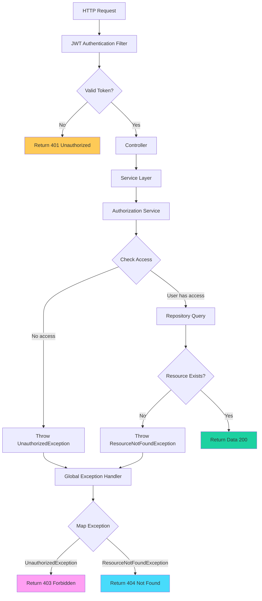

# Error Handling Documentation

## Overview

This document describes the error handling architecture implemented for the WallDot Customer API site reports feature. The implementation ensures consistent, predictable HTTP status codes and provides proper observability through correlation IDs.

## Exception Types

The application uses custom exceptions to provide consistent error responses:

| Exception | HTTP Status | Error Code | When Thrown | Example Scenario |
|-----------|-------------|------------|-------------|------------------|
| `ResourceNotFoundException` | 404 | `RESOURCE_NOT_FOUND` | Resource doesn't exist in database | Site report with ID 123 not found |
| `UnauthorizedException` | 403 | `ACCESS_DENIED` | User lacks permission to access resource | Customer attempts to access another customer's report |
| `BusinessException` | 400/custom | Custom | Business rule violation | Validation failures, state conflicts |
| `IllegalArgumentException` | 400 | `INVALID_ARGUMENT` | Invalid input parameter | Malformed request data |
| `NullPointerException` | 500 | `NULL_POINTER_ERROR` | Unexpected null value | Programming error requiring investigation |
| Generic `Exception` | 500 | `INTERNAL_ERROR` | Unexpected server failure | Unhandled errors requiring investigation |

## Error Response Format

All API errors return a standardized JSON response with the following structure:

```json
{
  "success": false,
  "message": "Human-readable error message",
  "errorCode": "RESOURCE_NOT_FOUND",
  "correlationId": "550e8400-e29b-41d4-a716-446655440000",
  "timestamp": 1707840000000,
  "path": "/api/customer/site-reports/123"
}
```

### Response Fields

- **success**: Always `false` for errors
- **message**: Human-readable error description (safe to display to users)
- **errorCode**: Machine-readable error code for client-side handling
- **correlationId**: Unique identifier for tracing this request in logs
- **timestamp**: Unix timestamp in milliseconds
- **path**: The API endpoint that was requested

## Correlation IDs

Every request is assigned a unique correlation ID (UUID) for distributed tracing:

### Flow

1. **Request Arrives**: `CorrelationIdFilter` intercepts the request
2. **ID Generation**: Correlation ID is read from `X-Correlation-ID` header or generated as UUID
3. **MDC Storage**: ID is stored in SLF4J MDC (Mapped Diagnostic Context)
4. **Logging**: All log statements include the correlation ID automatically
5. **Response Header**: ID is returned in `X-Correlation-ID` response header
6. **Error Response**: ID is included in error response body
7. **Cleanup**: MDC is cleared after request completes

### Usage

**Client sends correlation ID**:
```
GET /api/customer/site-reports/123
X-Correlation-ID: my-custom-trace-id
```

**Server uses it**:
```
2026-02-13 10:30:45.123 [my-custom-trace-id] WARN  AuthorizationService - User unauthorized
```

**Client receives it back**:
```
HTTP/1.1 403 Forbidden
X-Correlation-ID: my-custom-trace-id
{
  "correlationId": "my-custom-trace-id",
  "errorCode": "ACCESS_DENIED",
  ...
}
```

## Authorization Flow



### Step-by-Step Flow

1. **Authentication**: JWT filter validates token → 401 if invalid
2. **Controller**: Receives authenticated request
3. **Service Layer**: Calls authorization service
4. **Authorization Check**: 
   - Fetches user's accessible projects
   - Checks if requested resource belongs to accessible project
   - Throws `UnauthorizedException` if no access → 403
5. **Resource Fetch**: 
   - Queries database for resource
   - Throws `ResourceNotFoundException` if not found → 404
6. **Success**: Returns data with 200 status

## HTTP Status Code Guidelines

### 200 OK
- **When**: Request succeeded, resource found and accessible
- **Response**: Success data with `ApiResponse` wrapper

### 400 Bad Request
- **When**: Invalid input, validation failure
- **Examples**:
  - Missing required parameter
  - Invalid data format
  - Business rule violation
- **Response**: `ApiError` with validation details

### 401 Unauthorized
- **When**: Missing or invalid authentication token
- **Handled By**: Spring Security filters
- **Response**: `ApiError` with generic authentication message

### 403 Forbidden
- **When**: Valid authentication but insufficient permissions
- **Examples**:
  - Customer accessing another customer's report
  - User accessing project they're not assigned to
- **Response**: `ApiError` with generic "Access denied" message
- **Security**: Never reveal whether resource exists

### 404 Not Found
- **When**: Resource doesn't exist in database
- **Examples**:
  - Site report ID doesn't exist
  - Project ID doesn't exist
- **Response**: `ApiError` indicating resource not found
- **Important**: Only return 404 if resource truly doesn't exist, not for authorization failures

### 500 Internal Server Error
- **When**: Unexpected server failures only
- **Examples**:
  - Uncaught exceptions
  - Database connection failures
  - Null pointer exceptions (programming errors)
- **Response**: `ApiError` with generic message
- **Security**: Never expose stack traces or internal details

## Service Layer Architecture

### AuthorizationService

Centralized authorization logic:

```java
@Service
public class AuthorizationService {
    
    // Check if user can access specific report
    public void checkSiteReportAccess(String userEmail, Long reportId, String action) {
        // Throws ResourceNotFoundException or UnauthorizedException
    }
    
    // Get list of accessible project IDs (cached)
    @Cacheable("userProjects")
    public List<Long> getAccessibleProjectIds(String userEmail) {
        // Returns cached list for performance
    }
    
    // Check if user can access specific project
    public void checkProjectAccess(String userEmail, Long projectId, String action) {
        // Throws ResourceNotFoundException or UnauthorizedException
    }
}
```

### SiteReportService

Business logic layer:

```java
@Service
public class SiteReportService {
    
    // Get paginated reports with authorization
    @Transactional(readOnly = true, timeout = 5)
    public Page<CustomerSiteReportDto> getCustomerSiteReports(
            String userEmail, Long projectId, Pageable pageable) {
        // Uses AuthorizationService, throws exceptions on failure
    }
    
    // Get single report with authorization
    @Transactional(readOnly = true)
    public CustomerSiteReportDto getSiteReportById(String userEmail, Long reportId) {
        // Uses AuthorizationService, throws exceptions on failure
    }
}
```

## Logging Best Practices

### Log Levels

- **ERROR**: Unexpected exceptions requiring investigation (500 errors)
- **WARN**: Expected errors requiring attention (403, 404, 401)
- **INFO**: Normal operations, request summaries
- **DEBUG**: Detailed flow information for troubleshooting

### Example Logging

```java
// Successful operation
logger.info("Successfully retrieved {} site reports for user {}", count, email);

// Authorization failure (403)
logger.warn("[{}] User {} unauthorized to access report {}", 
    correlationId, userEmail, reportId);

// Resource not found (404)
logger.warn("[{}] Site report not found: {}", correlationId, reportId);

// Unexpected error (500)
logger.error("[{}] Unexpected error processing request", correlationId, exception);
```

## Security Considerations

### Information Disclosure Prevention

❌ **Bad - Reveals internal information**:
```json
{
  "error": "NullPointerException",
  "message": "Object reference not set to an instance at line 42",
  "stackTrace": ["com.wd.custapi.service.SiteReportService.getSiteReportById..."]
}
```

✅ **Good - Generic error message**:
```json
{
  "success": false,
  "message": "An unexpected error occurred",
  "errorCode": "INTERNAL_ERROR",
  "correlationId": "550e8400-e29b-41d4-a716-446655440000"
}
```

### Authorization Error Messages

❌ **Bad - Reveals resource existence**:
```
"Site report 123 exists but you don't have access to it"
```

✅ **Good - Generic denial**:
```
"Access denied"
```

This prevents attackers from discovering which resources exist through enumeration attacks.

## Performance Optimizations

### Caching

- **User Projects**: Cached for 5 minutes to reduce database queries
- **Cache Key**: User email address
- **Cache Hit Rate Target**: > 80%

### Database Indexes

- `idx_site_reports_project_date`: Optimizes project + date queries
- `idx_site_reports_project_ids`: Optimizes IN clause queries
- `idx_site_report_photos_report_id`: Optimizes photo loading

### Query Timeouts

- Read-only transactions have 5-second timeout
- Prevents long-running queries from blocking resources

## Testing

### Unit Tests

- Test exception throwing and handling
- Mock authorization service
- Verify correct status codes returned

### Integration Tests

- Test full request/response cycle
- Verify actual HTTP status codes
- Test with real authentication
- Validate error response format

## Monitoring

### Key Metrics

- **500 Error Rate**: Should be near zero
- **403 Rate**: May increase as authorization works correctly
- **404 Rate**: Normal for invalid resource IDs
- **Response Time P95**: Should be < 500ms
- **Cache Hit Rate**: Should be > 80%

### Alerts

- 500 errors > 0.1% of requests → Page oncall
- P95 response time > 2 seconds → Warning
- Cache hit rate < 60% → Investigation needed

## Deployment Checklist

- [ ] Database indexes created via Flyway migration
- [ ] Cache configuration enabled
- [ ] Correlation ID filter registered
- [ ] Exception handlers tested
- [ ] Monitoring dashboards updated
- [ ] Alert thresholds configured
- [ ] Documentation updated

---

**Document Version**: 1.0  
**Last Updated**: 2026-02-13  
**Status**: Production Ready
